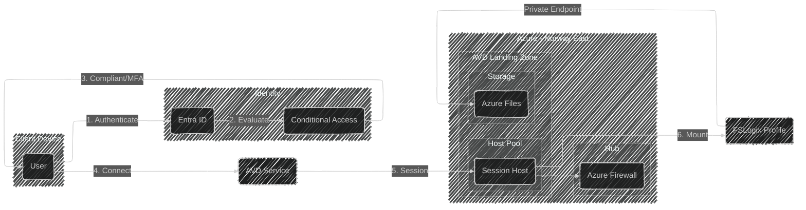

# Azure Virtual Desktop - Multisession Design for Contoso

## Scope

This document describes the design for an Azure Virtual Desktop (AVD) deployment for Contoso.
The design will cover the setup of a pooled host pool with Windows 11 Enterprise multisession session hosts, profile management using FSLogix with Azure Files, and secure access controls.

This design will cover:

- Host pool configuration with Windows 11 multisession session hosts
- FSLogix profile container storage using Azure Files
- Private Endpoints for secure connectivity
- Session host deployment in Norway East
- Conditional Access policies for secure access

This design will NOT cover:

- Detailed Intune and client management configuration
- Custom session host image creation
- Application deployment and configuration within session hosts
- Specific VM SKU selections or sizing recommendations
- Disaster recovery and business continuity procedures

## Rationale

Azure Virtual Desktop provides a scalable, secure, and cost-effective solution for delivering virtual desktops to Contoso users.
By using Windows 11 Enterprise multisession, multiple users can share a single virtual machine, reducing infrastructure costs while maintaining a full Windows 11 experience.

Key reasons for this design:

- **Cost efficiency**: Windows 11 multisession allows multiple users to share a single VM, reducing compute costs compared to personal desktop solutions.
- **User experience**: FSLogix profile containers ensure a consistent user experience across sessions with fast sign-in times.
- **Security**: Private Endpoints eliminate public internet exposure for storage and AVD connections, and Conditional Access ensures only compliant devices or MFA-authenticated users can access the environment.
- **Compliance**: Following Microsoft's enterprise scale architecture guidelines ensures the design is aligned with best practices.
- **Regional compliance**: Deploying in Norway East keeps data within the region and close to Contoso users.

## Alternatives Considered

| Alternative | Pros | Cons | Decision |
|-|-|-|-|
| **Windows 11 Enterprise multisession with FSLogix on Azure Files (Selected)** | Multiple users share VMs reducing costs; Fast sign-in with FSLogix; Azure Files is fully managed; Private Endpoints secure storage | Requires Premium file shares for optimal performance; More complex than single-session | ✅ **Chosen** |
| **Windows 11 Enterprise single-session (Personal desktops)** | Full dedicated resources per user; Simpler user profile management; Users can customize their environment | Higher costs as each user needs a dedicated VM; More VMs to manage; Higher licensing costs | ❌ Not chosen - Cost prohibitive for the use case |
| **Windows Server with Desktop Experience** | Mature technology; Lower licensing costs | Not a native Windows 11 experience; Different user experience than physical workstations; Limited app compatibility | ❌ Not chosen - User experience is not optimal |
| **FSLogix with Azure NetApp Files** | Higher performance; Enterprise-grade storage | Higher costs; More complex setup; May be overengineered for this use case | ❌ Not chosen - Azure Files meets requirements at lower complexity |
| **FSLogix with file server VMs** | Full control over storage; Can use existing file server infrastructure | Requires VM management; Higher operational overhead; Less scalable | ❌ Not chosen - Azure Files provides better manageability |

## Conceptual Design

Azure Virtual Desktop will be deployed in a dedicated landing zone in Norway East, following the hub-spoke network architecture.
Session hosts running Windows 11 Enterprise multisession will provide virtual desktops to Contoso users.
User profiles will be stored in FSLogix containers on an Azure Files share with Private Endpoints for secure access.
Access will be protected by Conditional Access policies requiring either a compliant device or MFA.

## Logical Design

The logical design for Azure Virtual Desktop in its own landing zone is detailed below.

### Landing Zone

A dedicated landing zone will be created for the AVD deployment.
This landing zone provides network isolation and clear cost boundaries for the virtual desktop environment.
The landing zone follows the standard Azure landing zone architecture with connectivity to the hub in Norway East.

### Host Pool Configuration

The host pool will be configured as a pooled host pool with the following characteristics:

- **Host pool type**: Pooled
- **Load balancing algorithm**: Breadth-first (distributes users across available session hosts)
- **Max session limit**: Configured based on VM sizing and expected user workload
- **Session host OS**: Windows 11 Enterprise multisession
- **Location**: Norway East

### Session Hosts

Session hosts will be deployed with the following configuration:

- **Operating System**: Windows 11 Enterprise multisession (latest version)
- **Join type**: Microsoft Entra ID joined or Hybrid joined (depending on application requirements)
- **Region**: Norway East
- **Virtual Network**: Connected to the AVD landing zone vNet
- **Management**: Managed through Intune

### FSLogix Profile Configuration

FSLogix profile containers will be used to manage user profiles:

- **Container type**: Profile container
- **Storage location**: Azure Files Premium share
- **VHD location path**: `\\<storageaccount>.file.core.windows.net\profiles`
- **Volume type**: VHDX (recommended for better performance)
- **Profile container size**: Dynamic, with maximum size configured based on requirements

### Storage Account Configuration

The storage account for FSLogix profiles will be configured as follows:

- **Storage account type**: FileStorage (Premium)
- **Performance tier**: Premium (SSD-based for low latency)
- **Redundancy**: Zone-redundant storage (ZRS) for high availability
- **File share**: SMB share for FSLogix profiles
- **Authentication**: Microsoft Entra ID Kerberos or Active Directory Domain Services
- **Private Endpoint**: Enabled for secure access from session hosts

### Network Architecture

The network configuration includes:

- **Virtual Network**: Deployed in the AVD landing zone
- **Subnets**:
  - Session host subnet
  - Private endpoint subnet
- **Hub connectivity**: Peering to the central hub for internet egress and on-premises access
- **Private Endpoints**:
  - Storage account (file)
  - Host pool (connection)
  - Workspace (feed)

### Private Endpoints

Private Endpoints will be configured for the following resources:

| Resource | Sub-resource | Purpose |
|-|-|-|
| Storage Account | file | FSLogix profile access from session hosts |
| Host Pool | connection | Secure session connections |
| Workspace | feed | Secure feed download |

### Conditional Access

Conditional Access policies will be configured to protect access to Azure Virtual Desktop:

**Policy 1: Require compliant device OR MFA for Azure Virtual Desktop**

- **Target**: Azure Virtual Desktop cloud app
- **Conditions**: All users accessing AVD
- **Grant controls**: Require one of the following:
  - Device marked as compliant
  - Microsoft Entra multifactor authentication
- **Session controls**: Sign-in frequency configured as needed

The policy ensures that users can only access the virtual desktop environment when:

1. They are using a device marked as compliant in Intune, OR
2. They have completed multifactor authentication

### Traffic Flow

1. User authenticates through Entra ID with Conditional Access evaluation
2. Conditional Access validates device compliance or requires MFA
3. User accesses the AVD feed through the Remote Desktop client or web client
4. AVD service establishes session to an available session host via Private Endpoint
5. Session host mounts FSLogix profile container from Azure Files via Private Endpoint
6. User session starts with their personalized profile
7. Internet-bound traffic routes through Azure Firewall in the hub

### Security

- **No public internet exposure**: Session hosts and storage are accessed only through Private Endpoints
- **Conditional Access**: Enforces compliant device or MFA requirement
- **Network Security Groups**: Restrict traffic to only necessary flows
- **Azure Firewall**: Centralized traffic inspection and control
- **Entra ID integration**: Centralized identity and access management

### Assumptions and Constraints

- Hub virtual network with Azure Firewall exists in Norway East
- Contoso users have appropriate Microsoft 365 or Azure AD licenses for Conditional Access and MFA
- Intune is configured for device compliance policies
- DNS resolution is configured for private endpoints (using Azure Private DNS zones)
- Network team has permissions to configure vNet peering

