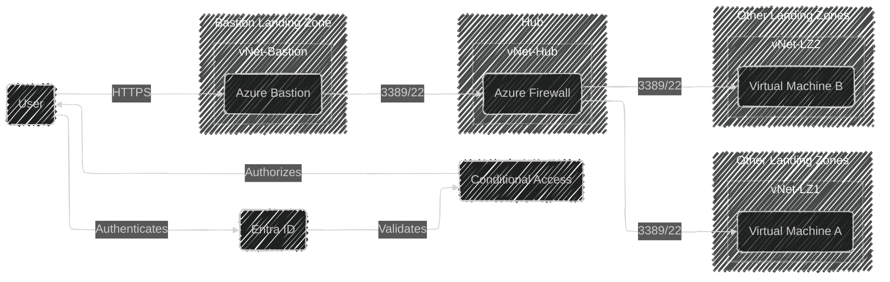

# Design Document: Azure Bastion

## Scope

This document outlines the design for usage of Azure Bastion.
The design will cover the Bastion service.
It will not cover the detailed configuration of individual virtual machines or the hub setup, outside of Bastion.

## Rationale

Azure Bastion provides secure and seamless RDP and SSH connectivity to virtual machines without exposing them to the public internet.
By placing Azure Bastion in its own dedicated landing zone, we ensure a clear separation of concerns and better manageability.
It also enables the platform team to provide this service to all other landing zones in the Azure environment.
The network traffic routing through the hub with Azure Firewall adds an additional layer of security and centralizes traffic control.
Cost will also be kept down by not deploying Bastion in every landing zone.
This approach avoids the common anti-pattern we see in the field, where Bastion is deployed in multiple landing zones, including internal ones, leading to unnecessary duplication and increased costs.

## Alternatives Considered
| Alternative | Pros | Cons |
|-|-|-|
| **Continue letting it be up to each customer how they want to do it** | Provides the highest level of freedom for customer  | Increases costs due to multiple Bastion instances |
|  | Simplifies access control within each landing zone | Adds operational complexity for management and maintenance |
| | | Duplicates resources and effort |
| | | Certain degree of anarchy |
| | | Inconsistent security policies across landing zones |
| **Deploying Azure Bastion in a dedicated landing zone, route traffic through the hub** | Centralizes Bastion management and reduces costs | Requires additional configuration for cross-landing zone access |
| | Provides a standardized approach for Bastion deployment | May introduce latency for cross-landing zone access |
| | Isolates the Bastion service from other services and the platform | The landing zone must deviate from the standard landing zone design |
| | | Authorization may be more complex or lacking |
| **Creating a standardized way for customers to deploy Bastion in their own landing zone, in its own vNet** | Provides flexibility for customers to manage their Bastion instances | Increases complexity and potential for misconfiguration |
| | Allows customers to tailor Bastion deployment to their specific needs | May lead to inconsistent configurations across landing zones |
| **Deploying Azure Bastion in the Hub** | Centralizes Bastion management and reduces costs | May introduce latency for cross-landing zone access |
| | Provides a standardized approach for Bastion deployment | Requires additional configuration for cross-landing zone access |
| | | Authorization may be more complex or lacking |

## Conceptual Design

The chosen solution deploys Azure Bastion in a dedicated landing zone with traffic routing through the hub:

## Logical Design

The logical design for Azure Bastion in its own landing zone is illustrated in the diagram below.

### Authentication

Azure Bastion leverages Entra ID for user authentication to the Bastion service.  
Access to Bastion is controlled through Conditional Access (CA) policies and role-based access control (RBAC), ensuring only authorized users can initiate RDP/SSH sessions.

### Security

- The Bastion landing zone is isolated from other landing zones, reducing the attack surface.
- The Azure Firewall enforces centralized security policies and logging for all remote access traffic.
- No direct RDP/SSH access is allowed to VMs from the public internet.
- Network Security Groups (NSGs) and firewall rules restrict traffic to only what is necessary.
- The public ip used for Azure Bastion will have DDoS protection enabled to mitigate potential DDoS attacks.

### Traffic Flow

1. Users initiate RDP/SSH sessions to Azure Bastion.
2. Azure Bastion forwards the session through the Azure Firewall in the Hub.
3. The Azure Firewall applies security policies and routes the traffic to the appropriate VM in another landing zone.

### Assumptions and Constraints

- All landing zones are peered or connected to the Hub.
- The Azure Firewall is configured to allow only necessary traffic from Bastion to VMs.
- The design does not cover detailed VM or Hub configuration, focusing on the Bastion service and its integration.

This approach ensures secure, auditable, and manageable remote access across the Azure environment while centralizing management and reducing costs.

## Alternatives Considered

| Alternative | Pros | Cons | Decision |
|-|-|-|-|
| **Continue letting it be up to each customer how they want to do it** | Provides the highest level of freedom for customer | Increases costs due to multiple Bastion instances; Adds operational complexity for management and maintenance; Duplicates resources and effort; Certain degree of anarchy; Inconsistent security policies across landing zones | ❌ Not chosen |
| **Deploying Azure Bastion in a dedicated landing zone, route traffic through the hub** | Centralizes Bastion management and reduces costs; Provides a standardized approach for Bastion deployment; Isolates the Bastion service from other services and the platform | Requires additional configuration for cross-landing zone access; May introduce latency for cross-landing zone access; The landing zone must deviate from the standard landing zone design; Authorization may be more complex or lacking | ✅ **Chosen** |
| **Creating a standardized way for customers to deploy Bastion in their own landing zone, in its own vNet** | Provides flexibility for customers to manage their Bastion instances; Allows customers to tailor Bastion deployment to their specific needs | Increases complexity and potential for misconfiguration; May lead to inconsistent configurations across landing zones | ❌ Not chosen |
| **Deploying Azure Bastion in the Hub** | Centralizes Bastion management and reduces costs; Provides a standardized approach for Bastion deployment | May introduce latency for cross-landing zone access; Requires additional configuration for cross-landing zone access; Authorization may be more complex or lacking | ❌ Not chosen |
