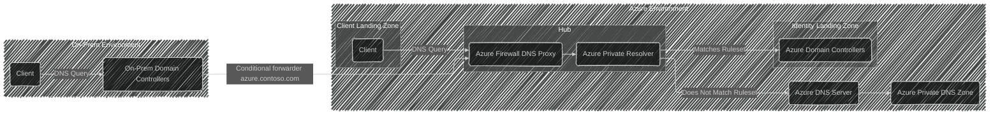

# DNS Setup, Azure

## Scope

This document describes the design of the DNS setup for our architecture.
It covers the integration between on-prem domain controllers, Azure Private Resolver, Azure Private DNS Zones and domain controllers in Azure.
It does not cover other DNS configurations unrelated to Azure or the on-prem environment.
It also does not cover public DNS.

## Rationale

The design aims to ensure seamless DNS resolution between the on-prem environment and Azure.
By using a Private Resolver in Azure, we can efficiently forward DNS queries to the appropriate domain controllers or resolve them directly, depending on the ruleset.
This setup minimizes latency and ensures high availability.

## Alternatives Considered

| Alternative | Description | Pros | Cons | Why Not Chosen |
|-|-|-|-|-|
| **Azure Private Resolver + Domain Controllers (Selected)** | Use Azure Private Resolver with forwarding rules to domain controllers and Azure DNS as needed | Flexible DNS resolution; Handles both corporate domains and Azure-specific zones; Optimized performance with intelligent routing; Supports Private DNS Zones for Azure services | Requires additional Azure service (Private Resolver); More complex configuration | N/A - This is the selected approach |
| **Domain Controllers Only** | Use only domain controllers for all DNS resolution, without Azure Private Resolver | Simpler architecture; Familiar to traditional IT teams; Single DNS service to manage | Domain controllers must handle all DNS traffic including Azure-specific queries; Higher load on domain controllers; No native integration with Azure Private DNS Zones; Requires manual configuration for all Azure services; Less optimal routing for Azure-internal queries | Does not leverage Azure-native DNS capabilities and puts unnecessary load on domain controllers for non-corporate DNS queries |
| **No DNS in Azure** | Rely entirely on on-premises DNS infrastructure with no DNS services deployed in Azure | Minimal Azure footprint; Lower Azure costs for DNS services | Azure resources cannot resolve DNS without connectivity to on-prem; Single point of failure if connection to on-prem is lost; High latency for Azure workloads querying DNS over ExpressRoute/VPN; No support for Azure Private DNS Zones; Azure services requiring DNS would fail during connectivity issues; Impossible to resolve Azure private endpoints and other Azure-internal resources | Unacceptable for production workloads as it creates a critical dependency on network connectivity and eliminates DNS resolution during any network disruption, making Azure resources unreachable |

## Conceptual Design

### Traffic flow

#### On-prem client

#### Azure client

## Logical Design

The logical design diagram is saved as a PNG file in this folder and included below:

