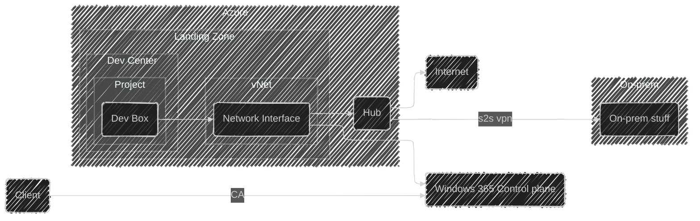

# Dev Box - Cloud Development Environment for Contoso

## Scope

This design document describes how the Microsoft Dev Box service can be set up for Contoso corp.
It will cover the infrastructure side of the configuration and conceptually how the service will be used by Team Bravo.
The Dev Box service will be deployed in the Norway East region following Microsoft's enterprise scale architecture guidelines.

This design will cover:

- Dev Center and Project configuration
- Network connectivity to the hub and on-premises resources
- User access through the Windows 365 control plane

This design will NOT cover:

- Intune and client management configuration
- Detailed dev box image customization
- Application deployment and configuration within dev boxes
- Specific SKU selections or sizing recommendations

## Rationale

The platform that Team Bravo is managing and developing for Contoso is purely cloud based, and the team needs to be able to develop and test their services in a cloud environment.
If the on-prem environment is down, the team needs to be able to continue their work in a cloud environment.
Microsoft Dev Box provides a managed, secure, and scalable solution for providing developer workstations without the overhead of managing physical hardware or traditional VDI infrastructure.

Key reasons for this design:

- **Cloud-native development**: Team Bravo works with cloud-based platforms and needs development environments that mirror production.
- **Business continuity**: Developers can continue working even if on-premises infrastructure is unavailable.
- **Security**: Dev boxes are managed through Intune and connect through secure network paths.
- **Self-service**: Team members can provision and manage their own dev boxes through the Dev Box portal.
- **Cost efficiency**: Dev boxes can be stopped when not in use, reducing compute costs.

## Alternatives Considered

| Alternative | Pros | Cons | Reason Not Chosen |
|------------|------|------|-------------------|
| **Microsoft Dev Box in dedicated landing zone (Selected)** | Managed service reduces operational overhead; Self-service portal for developers; Integrates with Windows 365 control plane; Network connectivity through hub | Requires network configuration for hub connectivity; Less control over underlying infrastructure | N/A - This is the selected approach |
| **Traditional VDI with Azure Virtual Desktop** | Full control over VM configuration; Familiar technology for IT teams | Higher operational overhead; More complex management; Requires dedicated infrastructure team | Dev Box provides better developer experience with lower management burden |
| **On-premises developer workstations** | Full control over hardware; No cloud dependencies | Physical hardware management; Business continuity risk if on-prem is down; Higher capital expenditure; Difficult to scale | Does not meet cloud-first strategy and creates single point of failure |
| **Azure VMs for each developer** | Full control over VM configuration; Flexible sizing options | No self-service portal; Higher management overhead; No native dev box features | Lacks the developer-focused features and self-service capabilities of Dev Box |

## Conceptual Design

Microsoft Dev Box will act as the primary developer workstation solution for members of Team Bravo.
A dev box in the sense of this design and the Dev Box service from Microsoft is a virtual machine running in a Microsoft hosted environment, managed in Contoso's tenant.
Members will use the Dev Box portal to manage their dev box(es).
The Dev Box service will be set up in its own landing zone and the dev boxes will be connected to the network in this landing zone.
Minimal customization will be done within the Dev Box service, as team members can customize their own dev boxes as needed.

The conceptual design of Dev Box includes the main components and their connections.
The following mermaid diagram illustrates the high-level design:

## Logical Design

The logical design for Microsoft Dev Box in its own landing zone is detailed below.

### Landing Zone

A dedicated landing zone will be created for the Dev Box service.
This landing zone provides network isolation and clear cost boundaries for the development environment.
The landing zone follows the standard Azure landing zone architecture with connectivity to the hub in Norway East.

### Dev Center and Project Structure

The Dev Center will be deployed in the landing zone and will contain:

- **Dev Center**: Central management point for dev box configurations and pools
- **Project**: Container for dev box pools, assigned to Team Bravo
- **Dev Box Pool**: Collection of dev box definitions with specific configurations

### Network Architecture

The network configuration includes:

- **Virtual Network**: Deployed in the landing zone with connectivity to the hub
- **Subnet**: Dedicated subnet for dev box network interfaces
- **Hub connectivity**: Peering to the central hub for on-premises access and internet egress

### Traffic Flow

1. Team Bravo member authenticates through Entra ID with Conditional Access
2. User accesses the Windows 365 control plane to manage their dev box
3. Dev box connects through the network interface in the landing zone vNet
4. Traffic to on-premises resources routes through the hub via site-to-site VPN
5. Internet traffic routes through the hub firewall

### Authentication and Authorization

- **Entra ID**: User authentication to the Dev Box portal
- **Conditional Access**: Policies to control access based on conditions
- **RBAC**: Role-based access control for Dev Center and Project resources

### Assumptions and Constraints

- Hub virtual network with site-to-site VPN already exists in Norway East
- Team Bravo members have appropriate Entra ID licenses
- Intune is configured and will be used for device management
- Network team has necessary permissions to configure peering
