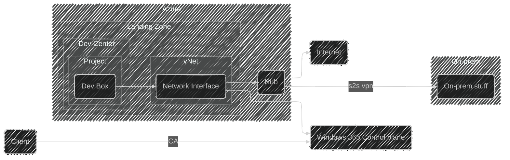

# Dev Box for Contoso Corp - Team Bravo

## Scope

This design document describes how the Microsoft Dev Box service will be deployed and configured for Contoso Corp, specifically to support Team Bravo's development needs.
It covers the infrastructure side of the configuration and conceptually how the service will be used within the organization.

This design will cover:

- Dev Center and Project configuration in Azure
- Landing zone setup and network integration
- Connectivity to on-premises resources via the hub
- User access through the Windows 365 control plane
- Conditional Access requirements for secure access

This design will NOT cover:

- Intune and client management configuration (handled separately by endpoint management team)
- Detailed Dev Box image customization (managed by Team Bravo per their requirements)
- Individual developer environment configurations
- Specific SKU sizing or cost optimization strategies
- Backup and disaster recovery for developer data

## Rationale

The platform that Team Bravo is managing and developing is purely cloud-based, and the team needs to be able to develop and test their services in a cloud environment.
If the on-premises environment experiences an outage, Team Bravo must be able to continue their work without interruption using cloud-based development workstations.

Key reasons for choosing Microsoft Dev Box:

- **Business Continuity**: Provides developer workstations that are independent of on-premises infrastructure availability.
- **Centralized Management**: Dev Center provides a single control point for managing developer environments across Team Bravo.
- **Network Integration**: Dev Boxes can connect to enterprise resources through the landing zone vNet and hub, maintaining security boundaries.
- **Self-Service**: Developers can provision and manage their own Dev Boxes through the Windows 365 portal, reducing IT overhead.
- **Security**: Conditional Access policies ensure only authorized users from compliant devices can access Dev Boxes.

Microsoft Dev Box is the preferred solution because it integrates natively with Entra ID and follows Microsoft's enterprise-scale architecture patterns that Contoso Corp already uses.

## Alternatives Considered

| Alternative | Description | Pros | Cons | Why Not Chosen |
|-|-|-|-|-|
| **Microsoft Dev Box in Dedicated Landing Zone (Selected)** | Deploy Dev Center and Dev Boxes in a dedicated landing zone with network connectivity through the hub | Native Entra ID integration; Self-service portal for developers; Follows enterprise-scale architecture; Network integration with on-prem resources; Managed by Microsoft | Requires landing zone setup; Ongoing subscription costs | N/A - This is the selected approach |
| **Azure Virtual Desktop (AVD)** | Use AVD to provide virtual desktops to developers | More flexible configuration options; Can use custom images; Multi-session support available | More complex to manage; Requires more infrastructure setup; Not optimized for development workloads; Higher operational overhead | Dev Box is specifically designed for developer scenarios with better integration with developer tools and simpler management |
| **Traditional Azure VMs** | Deploy individual Azure VMs for each developer | Full control over VM configuration; Can use any VM SKU; Familiar to IT teams | High management overhead; No self-service capability; Manual provisioning process; Requires custom automation for scaling | Does not provide the self-service experience needed for developer productivity and would significantly increase IT management burden |
| **On-Premises Development Workstations Only** | Continue with only physical workstations on-premises | No additional cloud costs; Existing infrastructure; Familiar to users | Single point of failure if on-prem is down; Cannot work during site outages; Limited flexibility for remote work | Does not address the business continuity requirement that is critical for Team Bravo's operations |
| **Windows 365 Cloud PC** | Use Windows 365 Cloud PCs instead of Dev Box | Simpler licensing model; Good for general productivity | Not optimized for development workloads; Limited customization; No Dev Center integration; Weaker developer tooling integration | Dev Box provides better developer-specific features including Dev Center organization and project-based management |

## Conceptual Design

Microsoft Dev Box will act as the privileged access management (PAM) solution for members of Team Bravo.
A Dev Box in the context of this design is a virtual machine running in a Microsoft-hosted environment, managed within Contoso Corp's own tenant.
Team members will use the Dev Box portal to provision and manage their Dev Box(es).
The Dev Box service will be set up in its own dedicated landing zone, and the Dev Boxes will be connected to the virtual network in this landing zone.
Minimal customization will be done within the Dev Box service initially, as team members can customize their own Dev Boxes as needed for their specific development tasks.

The conceptual design of Dev Box includes the main components and their connections.
The following mermaid diagram illustrates the high-level design:

## Logical Design

The logical design for Dev Box in its own landing zone is detailed below.

### Landing Zone

A dedicated landing zone will be created for the Dev Box service in the Norway East region, following Microsoft's enterprise-scale architecture guidelines.
This landing zone will contain the Dev Center, Dev Box definitions, and the virtual network infrastructure required for network connectivity.

### Dev Center and Project Structure

The Dev Center serves as the organizational container for Dev Box resources:

- **Dev Center**: Contoso Corp's centralized Dev Box management resource
- **Project**: Team Bravo project for organizing Dev Boxes and access control
- **Dev Box Definitions**: Standard configurations for Team Bravo development workstations
- **Dev Box Pools**: Collections of available Dev Boxes with specific network and definition configurations

### Network Architecture

**Virtual Network Configuration**:

- Dedicated vNet in the Dev Box landing zone
- Peered with the hub vNet in Norway East
- Network connections defined in Dev Center for Dev Box network attachment
- Dev Box network interfaces placed in designated subnet

**Traffic Flow**:

1. Developer authenticates through Entra ID with Conditional Access policies
2. Connection established to Windows 365 control plane
3. Dev Box traffic flows through the landing zone vNet
4. Traffic to on-premises resources routes through the hub via site-to-site VPN
5. Internet-bound traffic routes through the hub for centralized security

### Authentication and Access

**Entra ID Integration**:

- Users authenticate using Entra ID credentials
- Conditional Access policies control access to Dev Boxes
- Role-based access control (RBAC) manages permissions within the Dev Center

**Conditional Access Requirements**:

- Device compliance required
- Multi-factor authentication enforced
- Location-based policies applied per Contoso Corp security standards

### Security Considerations

- Dev Boxes are domain-joined or Entra ID-joined per organizational policy
- Network traffic is controlled through NSGs on the landing zone subnets
- Internet access is routed through the hub where Azure Firewall applies security policies
- Dev Box images can be customized to include required security agents and configurations

### Assumptions and Constraints

- Hub vNet with site-to-site VPN to on-premises already exists in Norway East
- Entra ID and Conditional Access are configured per Contoso Corp standards
- Team Bravo has appropriate licensing for Microsoft Dev Box
- Intune enrollment and device compliance policies are managed separately
- Developers have network connectivity to reach the Windows 365 control plane

This design ensures Team Bravo can maintain development productivity regardless of on-premises infrastructure status while maintaining Contoso Corp's security and compliance requirements.
