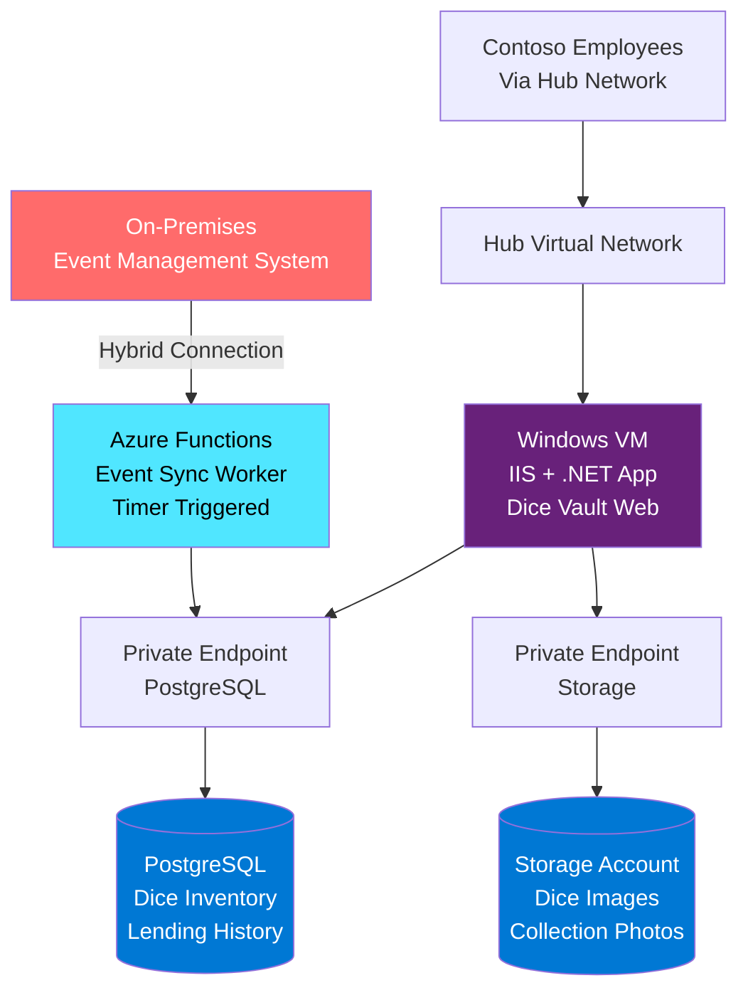
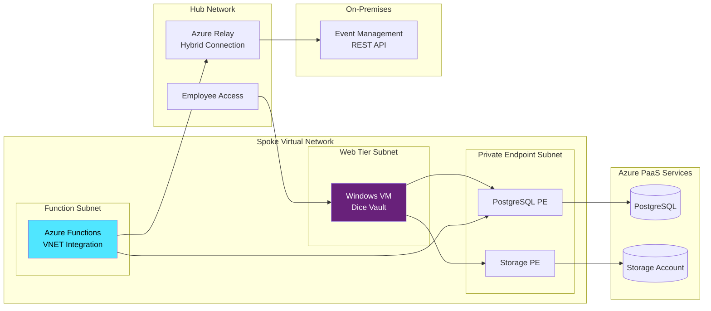

# Dice Vault - Digital Dice Collection Tracker for Contoso

## Scope

This design covers the deployment of Dice Vault, Contoso's internal application for tracking the company's physical dice collection used in gaming events and team-building activities.
Dice Vault manages dice inventory, tracks lending history, and synchronizes with the on-premises event management system.

This design will cover:

- Windows virtual machine hosting the .NET web application
- Azure Database for PostgreSQL for dice inventory and lending records
- Azure Storage Account for dice images and collection photos
- Azure Functions for integration with on-premises event management system
- Private endpoints for PaaS service connectivity
- Connection to Contoso hub virtual network

This design will NOT cover:

- Detailed network addressing schemes
- Specific SKU selections or sizing recommendations
- High availability or disaster recovery implementation
- Authentication and authorization mechanisms
- Backup and retention policies
- Monitoring and alerting configuration

## Rationale

Dice Vault serves Contoso's growing collection of specialty gaming dice (over 500 sets) used for corporate team-building D&D sessions.
The application needs to track which dice are on loan, when they're due back, and synchronize with the on-premises event calendar system to automatically reserve dice for scheduled events.

Key reasons for this design:

- **Windows VM**: Application is built in .NET Framework (legacy codebase) requiring Windows Server and IIS hosting.
- **PostgreSQL**: Provides JSON column support for flexible dice attribute storage (material, color, special features).
- **Storage Account**: Efficiently stores and serves dice photography for the catalog.
- **Azure Functions**: Serverless integration layer reduces complexity of maintaining a dedicated integration service.
- **Private Connectivity**: Ensures all data access stays within Contoso's network boundary.

The application name "Dice Vault" refers to the secure vaults used to store valuable treasures in D&D - fitting for Contoso's prized dice collection.

## Alternatives Considered

| Alternative | Pros | Cons | Reason Not Chosen |
|------------|------|------|-------------------|
| Azure App Service (Windows) | Fully managed, easier scaling, built-in deployment slots | Legacy .NET Framework app requires code modernization, team familiar with IIS management | Time constraints prevent modernizing to .NET Core, existing IIS expertise available |
| SQL Database instead of PostgreSQL | Native JSON support, better .NET tooling | Contoso standard is PostgreSQL for new applications | Corporate architecture standard mandates PostgreSQL |
| Logic Apps for integration | No-code integration, visual designer, more connectors | Higher cost, less control over custom logic | Azure Functions chosen for developer familiarity and code-based approach |
| Event Grid for event sync | Native event-driven architecture, push model | On-premises system uses polling API, not event-based | On-premises system limitations require polling pattern |
| File share instead of Storage Account | Simpler access pattern, SMB protocol support | No HTTP access, no blob lifecycle management | Web application needs HTTP access to serve images |

## Conceptual Design

### Key Components

- **Windows VM**: Runs IIS web server hosting the ASP.NET Dice Vault application
- **Azure Functions**: Timer-triggered function polls on-premises event API and updates PostgreSQL
- **PostgreSQL**: Stores dice inventory, lending records, and synchronized event data
- **Storage Account**: Blob storage for dice photographs and collection documentation
- **Private Endpoints**: Secure connectivity from VM and Functions to PaaS services
- **Hybrid Connection**: Azure Relay-based connection from Functions to on-premises system

## Logical Design

### Network Architecture

**Virtual Network Structure**:

- Spoke virtual network peered to Contoso hub
- Three subnets: Web tier, Functions integration, Private endpoints
- Network security groups controlling traffic between tiers
- Hub provides connectivity to on-premises and employee access

### Application Architecture

**Dice Vault Web Application**:

- ASP.NET Web Forms application running on IIS
- Authentication via Windows authentication (domain joined VM)
- Displays dice catalog with search and filtering
- Check-out/check-in workflow for lending dice
- Reports on collection value and lending statistics

**Data Flow**:

1. Employee browses dice catalog in web application
2. VM queries PostgreSQL for dice inventory via private endpoint
3. VM retrieves dice images from Storage Account via private endpoint
4. Employee checks out dice set for upcoming game session
5. Transaction recorded in PostgreSQL lending table

**Azure Functions Integration**:

- Timer trigger runs every 15 minutes
- Connects to on-premises event API via Azure Relay hybrid connection
- Retrieves upcoming gaming events from on-premises system
- Checks PostgreSQL for dice availability
- Creates automatic reservations for scheduled corporate events
- Logs sync status and errors to Application Insights

### Database Schema

**PostgreSQL Tables** (simplified):

- **dice_sets**: Catalog of all dice sets with JSON metadata
- **lending_records**: Check-out/check-in transactions with timestamps
- **reservations**: Future reservations tied to events
- **events**: Synchronized event data from on-premises system
- **users**: Employee information for lending history

### Storage Architecture

**Blob Containers**:

- **dice-images**: Individual dice set photographs
- **collection-photos**: Group photos of collection displays
- **documentation**: PDF guides and dice identification materials

### Integration Architecture

**Hybrid Connection Setup**:

- Azure Relay namespace deployed in hub region
- Hybrid Connection Manager installed on on-premises server
- Azure Functions connects to on-premises API through relay
- No inbound firewall rules required on-premises

**Event Synchronization Process**:

1. Timer trigger fires Azure Function
2. Function establishes connection through Azure Relay
3. On-premises API returns scheduled gaming events
4. Function transforms data to match dice reservation schema
5. Function updates PostgreSQL via private endpoint
6. Email notifications sent for dice needed for upcoming events

### Security Architecture

**Network Isolation**:

- All PaaS services accessible only via private endpoints
- VM domain-joined to Contoso Active Directory
- Functions deployed with VNET integration
- No public internet access from application components

**Data Security**:

- PostgreSQL enforces TLS connections
- Storage Account encryption at rest with Azure-managed keys
- VM disk encryption enabled
- Connection strings stored in Azure Key Vault (referenced by Functions)

**Access Control**:

- VM accessible via Azure Bastion from hub network
- RBAC roles limit access to Azure resources
- PostgreSQL uses Azure AD authentication
- Storage Account uses managed identity from Functions

### Private Endpoint Configuration

**Storage Account**:

- Private endpoint in dedicated subnet
- Linked to private DNS zone for blob service
- Accessible from VM and Functions subnets

**PostgreSQL**:

- Private endpoint in dedicated subnet
- Linked to private DNS zone for PostgreSQL
- Accessible from VM and Functions subnets

## Implementation Notes

### Component Relationships

**VM Dependencies**:

- Requires connection to PostgreSQL for data operations
- Requires connection to Storage Account for image serving
- Requires domain connectivity for Windows authentication
- Serves as primary user interface for employees

**Functions Dependencies**:

- Requires Azure Relay for on-premises connectivity
- Requires connection to PostgreSQL for data updates
- Requires Key Vault access for on-premises API credentials
- Operates independently of VM (asynchronous integration)

### Deployment Approach

**Infrastructure Deployment**:

1. Provision spoke virtual network with subnets
2. Create and configure private DNS zones
3. Deploy PostgreSQL and Storage Account
4. Create private endpoints and link DNS zones
5. Deploy and configure Windows VM with IIS
6. Deploy Azure Functions with VNET integration
7. Configure Azure Relay for hybrid connectivity

**Application Deployment**:

1. Deploy database schema to PostgreSQL
2. Upload initial dice images to Storage Account
3. Deploy Dice Vault web application to IIS
4. Configure application connection strings
5. Deploy Azure Functions code
6. Test hybrid connectivity to on-premises
7. Validate end-to-end scenarios

### Integration Testing

**Validation Points**:

- VM can reach PostgreSQL via private endpoint
- VM can retrieve blobs from Storage Account
- Functions can connect to on-premises API
- Functions can update PostgreSQL database
- Employees can access application through hub
- Images load correctly in web interface

## Future Considerations

- Migrate to ASP.NET Core for Azure App Service hosting
- Add second VM with load balancer for availability
- Implement additional Functions for other on-premises integrations
- Consider Azure API Management for integration API governance
- Explore Event Grid for real-time event notifications
