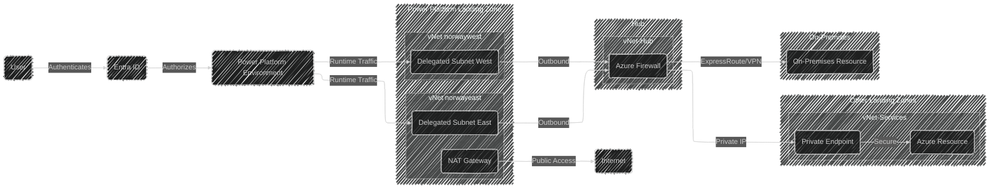

# Power Platform vNet Integration

## Scope

This document describes the design for integrating Power Platform with Azure Virtual Network (vNet) for our Norway deployment.
It covers the setup of a dedicated landing zone with vNet integration for Power Platform environments, including subnet delegation, enterprise policies, and network security.
It will not cover the detailed configuration of individual Power Apps or Power Automate flows, nor will it address application-level security beyond network boundaries.
It will not cover the setup of Power BI dataflows or ETL workloads using vNet data gateways, as those follow a different integration pattern.
It will not cover on-premises connectivity details beyond the high-level architecture.

## Rationale

Power Platform environments in Norway require secure connectivity to enterprise resources without exposing those resources to the public internet.
By deploying Power Platform with vNet integration in a dedicated landing zone, we enable secure communication between Power Platform services (such as Dataverse plug-ins and custom connectors) and private Azure resources or on-premises systems.
This approach leverages Azure subnet delegation to route all outbound traffic from Power Platform through our enterprise network, providing full control over security policies, monitoring, and compliance.
The dedicated landing zone design ensures separation of concerns, cost transparency, and simplified management while adhering to Microsoft best practices for Power Platform vNet support.
For the Norway region, this design supports both norwayeast and norwaywest Azure regions, ensuring business continuity and disaster recovery capabilities.

## Alternatives Considered

| Alternative | Description | Pros | Cons | Why Not Chosen |
|-|-|-|-|-|
| **Power Platform vNet Integration in Dedicated Landing Zone (Selected)** | Deploy Power Platform with vNet integration in a dedicated landing zone with subnet delegation to Microsoft.PowerPlatform/enterprisePolicies | Secure communication to private resources without public internet exposure; Full control over network policies and monitoring; Centralizes Power Platform networking; Clear cost separation; Follows Microsoft best practices; Supports business continuity with paired regions | Requires dedicated Azure infrastructure; Additional operational complexity; Requires careful subnet sizing planning | N/A - This is the selected approach |
| **Public Internet Integration** | Continue using Power Platform with public internet connectivity and service tags | Simpler initial setup; No additional Azure infrastructure required; Lower initial complexity | Exposes enterprise resources to public internet; Limited network control; Cannot access private endpoints; Violates security requirements; No support for private Azure resources; Higher security risk | Does not meet security requirements for enterprise resources and cannot access private Azure resources like private endpoints |
| **On-Premises Data Gateway Only** | Use only on-premises data gateways without vNet integration | Works with existing infrastructure; No need for vNet setup; Familiar to many organizations | Limited to specific connectors; Does not support API workloads like Dataverse plug-ins or custom connectors; Higher latency; Single point of failure; Requires on-prem infrastructure; Cannot access Azure private endpoints | Does not provide the full API workload support required and lacks the security benefits of vNet integration for Azure resources |
| **Power Platform vNet Integration in Shared Landing Zone** | Deploy Power Platform vNet integration in an existing shared landing zone with other services | Potentially lower infrastructure costs; Fewer landing zones to manage | Mixed security boundaries; Complex cost allocation; Harder to apply service-specific policies; Potential for resource contention; Non-standard landing zone design | Increases operational complexity and reduces security isolation, making it harder to manage and secure Power Platform independently |

## Conceptual Design

The chosen solution deploys Power Platform with vNet integration in a dedicated landing zone with traffic routing through the hub:

## Logical Design

The logical design for Power Platform vNet integration in a dedicated landing zone is detailed below.

### Landing Zone

A new dedicated landing zone will be created specifically for Power Platform vNet integration.
This landing zone provides network isolation, clear cost boundaries, and simplified security management.
The landing zone follows the standard Azure landing zone architecture with connectivity to the hub for centralized networking services.

### Virtual Networks and Subnets

Two virtual networks will be created in the Norway Azure regions:

- **vNet-norwayeast**: Primary virtual network in norwayeast region
- **vNet-norwaywest**: Failover virtual network in norwaywest region

Each virtual network will contain one delegated subnet specifically for Power Platform:

- Subnet delegation: **Microsoft.PowerPlatform/enterprisePolicies**
- Subnet size: /26 (62 usable IPs) minimum, /24 (251 usable IPs) recommended for future growth
- Both subnets must have the same number of available IP addresses

The subnet size calculation follows Microsoft guidance:
- 5 IPs reserved for basic Azure networking
- Estimate 1-2 IPs per concurrent plugin/connector execution
- Add buffer for growth and scaling
- Minimum /26 for initial deployment, /24 for production workloads

### Enterprise Policy

An Azure enterprise policy resource will be created to bind the Power Platform environment to the delegated subnets.
The enterprise policy is an Azure resource of type **Microsoft.PowerPlatform/enterprisePolicies** that:
- Links the Power Platform environment to the delegated subnets
- Enables subnet injection for Power Platform runtime containers
- Must be created in the same Azure subscription as the virtual networks

### Network Security

Network security will be implemented through multiple layers:

#### Network Security Groups (NSGs)

NSGs will be configured on the delegated subnets to control traffic flow:
- Allow outbound traffic to Azure Firewall
- Allow outbound to Azure service tags (AzureCloud, PowerPlatform)
- Deny direct outbound to internet (traffic goes through NAT Gateway)
- Allow necessary Azure platform communication
- Log all traffic for monitoring and compliance

#### Azure Firewall

The Azure Firewall in the hub will:
- Centrally control and log all traffic from Power Platform
- Enforce organizational security policies
- Route traffic to private endpoints and on-premises resources
- Provide threat intelligence and protection

#### NAT Gateway

An Azure NAT Gateway will be configured for the delegated subnets to:
- Provide static public IP for outbound internet connectivity
- Enable consistent outbound connections during transition period
- Support existing integrations that require public internet access
- Ensure no disruption to existing workloads

### Authentication and Authorization

Power Platform authentication and authorization will leverage:
- **Entra ID**: User authentication to Power Platform services
- **Conditional Access**: Policies to control access based on conditions
- **RBAC**: Role-based access control for Power Platform environments
- **Managed Identities**: For service-to-service authentication within Azure

### Monitoring and Observability

Network monitoring will be implemented using:
- **Virtual Network Flow Logs**: Capture all traffic flow in delegated subnets
- **Traffic Analytics**: Analyze traffic patterns and identify anomalies
- **Azure Monitor**: Centralized logging and alerting
- **Network Watcher**: Network diagnostics and troubleshooting

### Supported Workloads

The vNet integration will support the following Power Platform workloads:
- Dataverse plug-ins (generally available)
- Custom connectors (generally available)
- Azure Blob Storage connector
- Azure File Storage connector
- Azure Key Vault connector
- Azure Queues connector
- Azure SQL connector
- HTTP with Entra ID connector
- SQL Server connector

### Regional Configuration

For the Norway Power Platform region:
- **Power Platform region**: Norway
- **Primary Azure region**: norwayeast
- **Failover Azure region**: norwaywest
- Both virtual networks must be deployed in their respective regions
- VNet peering is not required between the two Power Platform vNets as they are paired for the enterprise policy

### Connectivity

The Power Platform landing zone vNets will be peered with the hub vNet:
- Hub-spoke topology with hub providing centralized services
- Azure Firewall in hub provides centralized security
- ExpressRoute or VPN in hub provides on-premises connectivity
- Private DNS resolution through hub

### Traffic Flow

1. User authenticates to Power Platform via Entra ID with Conditional Access policies
2. Power Platform runtime triggers (plug-in or connector execution)
3. Container is injected into delegated subnet using IP from subnet range
4. Outbound call from container goes through NSG to Azure Firewall
5. Azure Firewall applies security policies and routes to destination:
   - Private endpoints for Azure PaaS services
   - ExpressRoute/VPN for on-premises resources
   - NAT Gateway for public internet (if needed)
6. Response returns through same path

### Assumptions and Constraints

- Power Platform environment is in Norway region
- Azure subscription has necessary permissions and resource provider registrations
- Hub vNet with Azure Firewall already exists
- ExpressRoute or VPN connectivity to on-premises already exists
- Subnet size is appropriately planned for current and future needs
- Once delegated, subnet size changes require Microsoft Support
- Power Platform licensing includes necessary features for vNet support
- Network team has necessary Azure RBAC permissions (Network Contributor)

This approach ensures secure, compliant, and manageable Power Platform integration with enterprise resources while maintaining network isolation and following Azure best practices.
