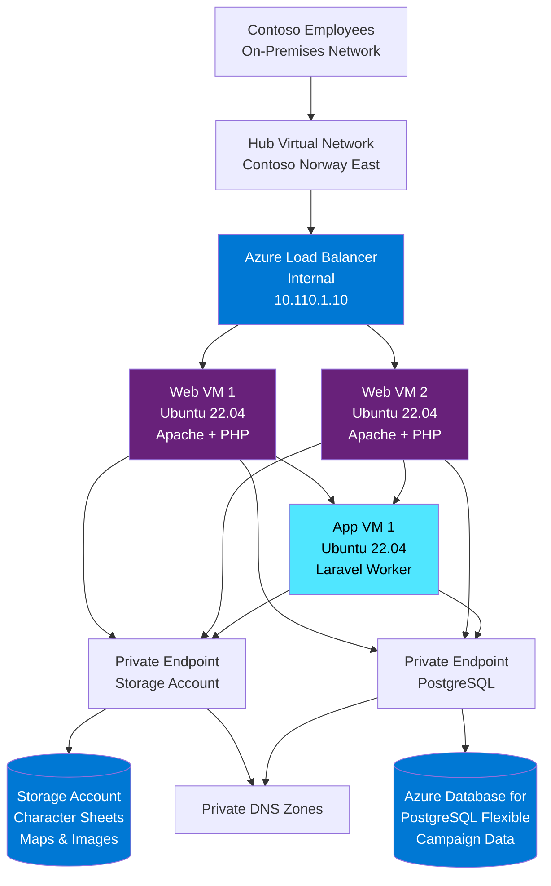

# Spell Scribe - Campaign Documentation System for Contoso

## Scope

This design covers the deployment of Spell Scribe, Contoso's internal campaign documentation and knowledge management system for the tabletop gaming community team.
Spell Scribe allows dungeon masters and players to document campaigns, track character sheets, store session notes, and share homebrew content.

This design will cover:

- Three virtual machines running a PHP/Laravel web application (web tier and app tier)
- Azure Database for PostgreSQL Flexible Server for relational data storage
- Azure Storage Account for file storage (character sheets, maps, images)
- Private endpoints for all PaaS services
- Azure Load Balancer for distributing traffic across web VMs
- Integration with Contoso hub virtual network in Norway East

This design will NOT cover:

- High availability beyond basic VM availability sets
- Disaster recovery or backup strategies (standard Azure backup assumed)
- Advanced caching layers (Redis, CDN)
- Custom domain SSL certificates
- Microsoft Entra ID integration (basic authentication used)
- CI/CD pipelines or deployment automation
- Multi-region deployment
- Auto-scaling configurations

## Rationale

Spell Scribe is an internal tool for Contoso's growing tabletop gaming community (200+ employees participate in weekly D&D sessions).
The application requires moderate performance and basic high availability but doesn't need the complexity of App Service Environment or Kubernetes.

Key reasons for this design:

- **Simplicity**: Traditional VM-based architecture is well-understood by Contoso's operations team and easy to troubleshoot.
- **Cost-Effective**: VMs with standard SKUs provide adequate performance at lower cost than PaaS compute for this workload.
- **Flexibility**: VMs allow installation of specific PHP extensions and custom libraries needed for character sheet PDF generation.
- **Private Connectivity**: Private endpoints ensure all data access remains within Contoso's virtual network with no internet exposure.
- **Proven Stack**: LAMP-style architecture (Linux, Apache, MySQL-compatible, PHP) is reliable and has abundant community support.

The application name "Spell Scribe" refers to the magical scribes in D&D who document spells and magical knowledge - fitting for a documentation system.

## Alternatives Considered

| Alternative | Pros | Cons | Reason Not Chosen |
|------------|------|------|-------------------|
| Azure App Service | Fully managed, built-in scaling, easier deployment | Higher cost for equivalent compute, less control over PHP environment | Team prefers VM control for custom PHP extensions and legacy library compatibility |
| Single larger VM | Simpler architecture, lower management overhead | No redundancy, single point of failure, can't handle traffic spikes | Need basic HA for when multiple D&D groups access simultaneously |
| Azure Database for MySQL | More common for PHP applications, mature service | Contoso standardized on PostgreSQL for all new applications, better JSON support | Corporate standard mandates PostgreSQL for consistency |
| Blob Storage only (no VMs) | Much lower cost, serverless static site hosting | Application requires server-side PHP processing and database queries | Dynamic application with complex backend logic requires compute |
| Managed Kubernetes (AKS) | Modern architecture, better scaling, container benefits | Excessive complexity for simple LAMP app, requires different skillset | Overkill for a three-tier web application serving internal users |

## Conceptual Design

### Key Components

- **Azure Load Balancer**: Internal load balancer distributing HTTP traffic across web VMs
- **Web VMs (x2)**: Ubuntu 22.04 with Apache and PHP serving the Laravel application frontend
- **App VM (x1)**: Ubuntu 22.04 running Laravel queue workers for background tasks
- **PostgreSQL Flexible Server**: Managed database service with private endpoint connectivity
- **Storage Account**: Blob storage for user-uploaded files with private endpoint
- **Private DNS Zones**: Name resolution for private endpoint connections

## Logical Design

The logical design diagram will be created in Excalidraw and stored as `Logical-SpellScribe.png` in this directory.

### Network Architecture

**Virtual Network**: Spell Scribe spoke network

- Address Space: 10.110.0.0/16
- Region: Norway East
- Peering: Connected to Contoso hub virtual network

**Subnets**:

- Web Tier Subnet: 10.110.1.0/24
  - Azure Load Balancer: 10.110.1.10
  - Web VM 1: 10.110.1.11
  - Web VM 2: 10.110.1.12
- App Tier Subnet: 10.110.2.0/24
  - App VM 1: 10.110.2.11
- Private Endpoint Subnet: 10.110.3.0/24
  - Storage Account PE: 10.110.3.4
  - PostgreSQL PE: 10.110.3.5

### Virtual Machine Specifications

**Web VMs (spellscribe-web-01, spellscribe-web-02)**:

- SKU: Standard_B2s (2 vCPU, 4 GB RAM)
- OS: Ubuntu 22.04 LTS
- Managed Disk: 64 GB Premium SSD
- Availability Set: spellscribe-web-avset (2 fault domains, 5 update domains)
- Network: Web Tier subnet with NSG
- Software: Apache 2.4, PHP 8.2, Laravel application

**App VM (spellscribe-app-01)**:

- SKU: Standard_B2ms (2 vCPU, 8 GB RAM)
- OS: Ubuntu 22.04 LTS
- Managed Disk: 64 GB Premium SSD
- Network: App Tier subnet with NSG
- Software: PHP 8.2, Laravel queue worker, Supervisor

### Storage Architecture

**Azure Storage Account** (spellscribestorage):

- SKU: Standard LRS (Locally Redundant Storage)
- Performance: Standard
- Kind: StorageV2
- Access tier: Hot
- Public network access: Disabled
- Private endpoint: In private endpoint subnet

**Blob Containers**:

- `character-sheets`: PDF and JSON files for character sheets
- `campaign-maps`: Image files (PNG, JPG) for dungeon maps
- `session-notes`: Uploaded documents and images
- `homebrew-content`: User-created content files

### Database Architecture

**Azure Database for PostgreSQL Flexible Server** (spellscribe-postgres):

- SKU: Burstable B2s (2 vCores, 4 GB RAM)
- Storage: 32 GB
- PostgreSQL Version: 15
- High Availability: Disabled (not required for this use case)
- Public network access: Disabled
- Private endpoint: In private endpoint subnet

**Database Schema** (simplified):

- `users`: User accounts and profiles
- `campaigns`: Campaign metadata and settings
- `characters`: Player character information
- `sessions`: Session notes and summaries
- `locations`: Campaign locations and descriptions
- `npcs`: Non-player character database
- `items`: Magical items and equipment

### Traffic Flow

**User Access Flow**:

1. Employee at Contoso office accesses http://spellscribe.internal.contoso.com
2. Request routes through hub virtual network to spoke via peering
3. Request reaches Azure Load Balancer (10.110.1.10)
4. Load Balancer distributes to Web VM 1 or Web VM 2
5. Apache/PHP processes request, queries PostgreSQL via private endpoint
6. Response returned to user

**File Upload Flow**:

1. User uploads character sheet PDF via web interface
2. Web VM receives upload
3. Web VM writes file to Storage Account via private endpoint
4. Storage Account returns blob URL
5. Web VM stores reference in PostgreSQL database
6. Confirmation returned to user

**Background Processing Flow**:

1. User requests PDF export of campaign notes
2. Web VM creates job in PostgreSQL queue table
3. App VM (Laravel worker) polls queue via private endpoint
4. App VM generates PDF and stores in Storage Account
5. App VM updates job status in PostgreSQL
6. User receives notification when PDF ready

### Security Architecture

**Network Security Groups**:

- Web Tier NSG:
  - Allow inbound: HTTP (80) from hub virtual network
  - Allow inbound: HTTPS (443) from hub virtual network
  - Allow inbound: SSH (22) from jumpbox subnet (hub)
  - Allow outbound: PostgreSQL (5432) to private endpoint subnet
  - Allow outbound: HTTPS (443) to private endpoint subnet (Storage)
  - Deny all other inbound

- App Tier NSG:
  - Allow inbound: SSH (22) from jumpbox subnet (hub)
  - Allow outbound: PostgreSQL (5432) to private endpoint subnet
  - Allow outbound: HTTPS (443) to private endpoint subnet (Storage)
  - Deny all other inbound

- Private Endpoint Subnet NSG:
  - Allow inbound: PostgreSQL (5432) from web and app tier subnets
  - Allow inbound: HTTPS (443) from web and app tier subnets
  - Deny all other inbound

**Data Security**:

- PostgreSQL: TLS 1.2 enforced, Azure AD authentication optional
- Storage Account: Encryption at rest (Microsoft-managed keys)
- VMs: Azure Disk Encryption enabled
- Secrets: Stored in /etc/spellscribe/.env (file permissions 600)

**Access Control**:

- VM access: Azure Bastion from hub network (no public IPs)
- RBAC: Operators have VM Contributor, DBAs have SQL Administrator
- Service authentication: Managed identities not used (connection strings in config)

### Private Endpoint Configuration

**Storage Account Private Endpoint**:

- Name: spellscribe-storage-pe
- Subnet: Private Endpoint Subnet (10.110.3.0/24)
- Private IP: 10.110.3.4
- Target sub-resource: blob
- Private DNS zone: privatelink.blob.core.windows.net
- DNS integration: Enabled (auto-registration)

**PostgreSQL Private Endpoint**:

- Name: spellscribe-postgres-pe
- Subnet: Private Endpoint Subnet (10.110.3.0/24)
- Private IP: 10.110.3.5
- Target sub-resource: postgresqlServer
- Private DNS zone: privatelink.postgres.database.azure.com
- DNS integration: Enabled (auto-registration)

### Load Balancer Configuration

**Azure Load Balancer** (spellscribe-lb):

- Type: Internal (private IP only)
- SKU: Standard
- Frontend IP: 10.110.1.10 (static)
- Backend pool: Web VM 1, Web VM 2

**Health Probe**:

- Protocol: HTTP
- Port: 80
- Path: /health
- Interval: 5 seconds
- Unhealthy threshold: 2 consecutive failures

**Load Balancing Rule**:

- Frontend port: 80
- Backend port: 80
- Protocol: TCP
- Session persistence: None (stateless application)
- Idle timeout: 4 minutes

### Cost Estimate

**Monthly Cost** (estimated):

- Web VMs (2x Standard_B2s): ~$60
- App VM (1x Standard_B2ms): ~$40
- Managed Disks (3x 64GB Premium SSD): ~$30
- Load Balancer (Standard): ~$20
- PostgreSQL Flexible Server (Burstable B2s): ~$45
- Storage Account (1TB data, Standard LRS): ~$20
- Private Endpoints (3 endpoints): ~$22
- Bandwidth and other: ~$13

**Total estimated monthly cost: ~$250**

### Monitoring

**Azure Monitor Metrics**:

- VM CPU and memory utilization
- Load balancer health probe status
- PostgreSQL connection count and query performance
- Storage Account request rate and latency

**VM-Level Monitoring**:

- Apache access and error logs
- Laravel application logs
- PHP error logs
- Queue worker status (Supervisor)

**Alerts**:

- VM CPU > 80% for 10 minutes
- Load balancer unhealthy backend (both VMs down)
- PostgreSQL storage > 80% full
- Storage Account throttling errors

## Future Considerations

- Add third web VM during peak usage periods (campaign season)
- Implement Azure Backup for VMs and PostgreSQL
- Consider upgrading PostgreSQL to zone-redundant HA for production
- Add Azure Front Door if external access needed in future
- Implement automated deployment scripts or Ansible playbooks
- Integrate with Microsoft Entra ID for SSO
- Add Redis cache for session storage (improve performance)
