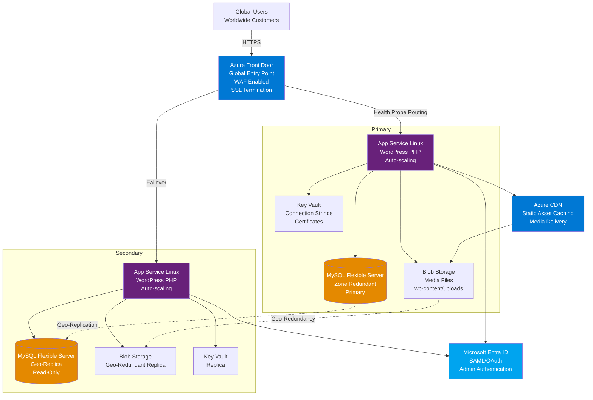

# Contoso Corp Public Blog - WordPress on Azure

## Scope

This design covers the deployment of an outward-facing WordPress blog for Contoso Corp to share news and product updates with customers worldwide.
The blog must be globally accessible, highly resilient, and allow administrators and publishers to authenticate using their existing Microsoft Entra ID (formerly Azure AD) credentials.

This design will cover:

- WordPress hosting on Azure App Service for Linux with built-in high availability
- Azure Front Door for global content delivery and traffic acceleration
- Azure Database for MySQL Flexible Server for WordPress database
- Azure Blob Storage for media files and static assets
- Microsoft Entra ID integration for admin and publisher authentication
- Azure CDN for global caching and performance optimization
- Web Application Firewall (WAF) for security protection
- SSL/TLS certificate management with automatic renewal
- Multi-region deployment strategy for resilience
- Backup and disaster recovery configuration

This design will NOT cover:

- Content migration from existing blog platforms
- Custom WordPress plugin development or third-party plugin selection
- SEO optimization strategies or content management workflows
- Integration with CRM or marketing automation systems
- Mobile application development for the blog
- E-commerce functionality or payment processing
- Multi-language support or content translation services
- Performance load testing results or capacity planning details

## Rationale

Contoso Corp needs a public-facing blog to engage with its global customer base and share product announcements, technical articles, and company news.
The blog must provide excellent performance regardless of visitor location and remain available even during regional outages or traffic spikes.

Key reasons for this design:

- **WordPress Platform**: Provides extensive customization options, rich plugin ecosystem, and intuitive content management that non-technical users can easily use. Meets the requirement for "lots of room for future improvements and easily customized."
- **Azure App Service**: Fully managed PaaS eliminates infrastructure management overhead while providing built-in scaling, patching, and high availability. Linux-based hosting optimizes cost and performance for PHP applications.
- **Global Distribution**: Azure Front Door provides intelligent routing to the nearest healthy endpoint, ensuring fast page loads for users worldwide regardless of their geographic location.
- **Entra ID Integration**: WordPress can authenticate administrative users via SAML or OAuth against Entra ID, allowing publishers and admins to use their existing corporate credentials without managing separate passwords.
- **Resilience**: Multi-region deployment with Front Door health probes and automatic failover ensures the blog remains available even if an entire Azure region experiences an outage.
- **Managed Database**: Azure Database for MySQL Flexible Server provides automated backups, patching, and high availability with zone redundancy, reducing operational burden.
- **Media Performance**: Azure Blob Storage with CDN integration ensures fast delivery of images and media files globally, improving user experience and reducing App Service bandwidth costs.

The design prioritizes simplicity and manageability while meeting enterprise requirements for global availability, security, and identity integration.

## Alternatives Considered

| Alternative | Pros | Cons | Reason Not Chosen |
|------------|------|------|-------------------|
| Static site generator (Hugo, Jekyll, Gatsby) | Excellent performance, no database needed, simple deployment, version control for content | Requires technical skills for content authoring, limited dynamic functionality, doesn't meet "git based simple variants" requirement explicitly rejected in issue | User specifically stated they don't like git-based simple variants and want WordPress for customization |
| Azure Virtual Machines with WordPress | Complete control over configuration, can run any WordPress plugin | High operational overhead, manual scaling and patching, less resilient, doesn't leverage PaaS benefits | Violates Contoso's PaaS-first strategy and increases management burden |
| Azure Kubernetes Service (AKS) | Flexible container orchestration, multi-tenancy, microservices ready | Excessive complexity for single application, requires Kubernetes expertise, higher cost | WordPress is a monolithic application that doesn't require container orchestration complexity |
| Managed WordPress offerings (WordPress.com, WP Engine) | Fully managed, optimized for WordPress, simplified operations | Vendor lock-in, limited Azure integration, cannot integrate directly with Entra ID, data residency concerns | Contoso requires Entra ID integration and prefers keeping infrastructure within their Azure tenant for compliance |
| Azure Container Instances | Simpler than AKS, good for stateless apps, low cost | Not designed for long-running web applications, limited networking features, no built-in load balancing | App Service provides better web hosting capabilities and built-in features for web applications |
| Azure Static Web Apps | Excellent for modern frameworks, integrated CI/CD, global distribution | Limited support for traditional CMS like WordPress, designed for JAMstack architecture | WordPress is a dynamic PHP application requiring database and traditional hosting |

## Conceptual Design



### Key Components

- **Azure Front Door**: Global entry point with WAF protection, SSL termination, intelligent routing, and automatic failover between regions
- **App Service for Linux**: Managed WordPress hosting with PHP runtime, auto-scaling, and built-in deployment slots
- **MySQL Flexible Server**: Managed database service with zone redundancy, automated backups, and geo-replication for disaster recovery
- **Blob Storage**: Scalable storage for WordPress media files with geo-redundant replication
- **Azure CDN**: Content delivery network for caching static assets and media globally
- **Microsoft Entra ID**: Identity provider for admin and publisher authentication via SAML or OAuth
- **Key Vault**: Secure storage for database connection strings, API keys, and SSL certificates

## Logical Design

### Network Architecture

**Primary Region - Norway East**:

- WordPress App Service: Standard S2 tier (2 vCPU, 3.5 GB RAM) with auto-scaling (2-5 instances)
- MySQL Flexible Server: Burstable B2s tier (2 vCPU, 4 GB RAM) with zone redundancy enabled
- Storage Account: Standard GRS (geo-redundant storage) for media files
- Virtual Network Integration: App Service integrated with dedicated subnet for secure database connectivity

**Secondary Region - West Europe**:

- WordPress App Service: Matching configuration for failover
- MySQL Flexible Server: Read replica for disaster recovery and read scaling
- Storage Account: Automatic geo-replication from primary region

**Front Door Configuration**:

- Global anycast IP for DNS resolution
- Origin groups with health probes (30-second intervals)
- Priority-based routing (primary first, failover to secondary)
- Session affinity for admin sessions
- WAF policy with OWASP CRS 3.2 ruleset

### WordPress Application Architecture

**WordPress Configuration**:

- WordPress version: Latest stable (auto-updated via App Service)
- PHP version: 8.2 or later
- Web server: Apache or Nginx (App Service managed)
- Persistent storage mounted from Blob Storage via Azure Files or custom plugin

**Required WordPress Plugins**:

- **Entra ID Authentication Plugin**: SAML or OAuth plugin (miniOrange SAML SSO, WP OAuth Server, or Azure AD Single Sign-On)
- **Object Storage Plugin**: Azure Blob Storage plugin to offload media files from local filesystem
- **CDN Integration Plugin**: Rewrite URLs to serve media via Azure CDN
- **Caching Plugin**: Redis Object Cache (Azure Cache for Redis optional)
- **Security Plugin**: Wordfence or similar (in addition to WAF)
- **Backup Plugin**: UpdraftPlus with Azure Blob Storage backend

**WordPress Database Configuration**:

- Standard WordPress tables (wp_posts, wp_users, wp_options, etc.)
- Database connection via SSL/TLS required
- Connection string stored in Key Vault
- App Service managed identity for Key Vault access

### Authentication and Authorization Flow

**Public Content Access**:

1. Anonymous user accesses blog.contoso.com
2. Azure Front Door serves cached content from nearest CDN edge
3. Dynamic content routed to primary App Service
4. WordPress renders public pages without authentication
5. Content cached by Front Door and CDN

**Admin and Publisher Access**:

1. User navigates to blog.contoso.com/wp-admin
2. WordPress redirects to Entra ID SAML endpoint
3. User authenticates with Contoso corporate credentials (username@contoso.com)
4. Entra ID validates credentials and returns SAML assertion
5. WordPress plugin validates assertion and creates session
6. User lands in WordPress admin dashboard with role-based permissions
7. Subsequent requests authenticated via WordPress session cookie

**Role Mapping**:

- Entra ID group "Blog Administrators" → WordPress Administrator role
- Entra ID group "Blog Publishers" → WordPress Editor role
- Entra ID group "Blog Contributors" → WordPress Author role
- All other authenticated users → WordPress Subscriber role (optional)

### Data Flow and Content Delivery

**Content Publishing Flow**:

1. Publisher logs in via Entra ID authentication
2. Creates or edits blog post in WordPress admin
3. Uploads featured image or media files
4. Media uploaded to Azure Blob Storage via WordPress plugin
5. Post content saved to MySQL database
6. Publisher clicks "Publish"
7. WordPress marks post as published in database
8. Front Door cache purged for updated URLs (optional webhook)

**Content Consumption Flow**:

1. Reader in Asia visits blog.contoso.com
2. DNS resolves to Azure Front Door global anycast IP
3. Front Door routes to nearest CDN edge location
4. CDN checks cache for page content
5. Cache miss: Request forwarded to primary App Service in Norway East
6. WordPress queries MySQL for post content
7. WordPress generates HTML response
8. Response cached by Front Door edge for future requests
9. Static assets (images, CSS, JS) served directly from CDN

**Media Delivery Flow**:

1. WordPress page references image: blog.contoso.com/wp-content/uploads/2026/01/image.jpg
2. CDN plugin rewrites URL to: cdn.contoso.com/uploads/2026/01/image.jpg
3. Azure CDN serves image from nearest edge location
4. Edge cache miss: CDN fetches from Blob Storage
5. Image cached at CDN edge for 30 days
6. Subsequent requests served from edge cache

### High Availability and Disaster Recovery

**Multi-Region Active-Passive Strategy**:

- **Normal Operations**: All traffic routed to primary region (Norway East)
- **Primary Failure**: Front Door health probe detects failure, routes traffic to secondary region (West Europe)
- **Recovery Time Objective (RTO)**: ~2 minutes (health probe interval + DNS TTL)
- **Recovery Point Objective (RPO)**: ~5 minutes (MySQL replication lag)

**Health Probes**:

- Front Door health probe: HTTP GET to /wp-admin/install.php (returns 200 if WordPress operational)
- Probe interval: 30 seconds
- Failure threshold: 2 consecutive failures trigger failover
- Probe path checks both App Service and database connectivity

**Backup Strategy**:

- MySQL automated backups: 7-day retention, point-in-time restore
- MySQL geo-restore: Secondary region read replica can be promoted to primary
- Blob Storage geo-redundancy: Media files replicated to secondary region
- WordPress configuration backup: Weekly backup of wp-config.php and plugin settings to Blob Storage
- Database backup testing: Monthly restore validation to test environment

**Disaster Recovery Scenarios**:

1. **App Service Failure**: Front Door automatically fails over to secondary region (~30 seconds)
2. **MySQL Primary Failure**: Zone-redundant HA automatically fails to standby within zone (~60 seconds)
3. **Region Failure**: Front Door routes to secondary region, MySQL replica promoted to primary (~2-5 minutes manual process)
4. **Data Corruption**: Restore from MySQL point-in-time backup (~15-30 minutes)

### Security Architecture

**Network Security**:

- App Service virtual network integration for secure database access
- MySQL firewall rules: Only allow App Service subnet and authorized admin IPs
- Private endpoints for Blob Storage (optional for enhanced security)
- Front Door WAF blocks malicious traffic before reaching App Service
- DDoS protection standard on Front Door

**Application Security**:

- WAF rules: OWASP CRS 3.2 baseline, custom rules for WordPress-specific attacks
- Rate limiting: 100 requests per minute per IP on /wp-admin paths
- Bot protection: Challenge suspicious user agents and known bad bots
- Geo-filtering: Optional blocking of countries not in target market
- WordPress hardening: Disable XML-RPC, limit login attempts, hide version

**Data Security**:

- MySQL data encrypted at rest with Azure-managed keys
- MySQL connections encrypted with TLS 1.2+
- Blob Storage encrypted at rest (default Azure encryption)
- HTTPS enforced for all traffic (HTTP redirects to HTTPS)
- Key Vault for secrets management with managed identity access

**Identity Security**:

- Entra ID multi-factor authentication enforced for admin accounts
- Conditional access policies: Require compliant device for admin access
- App Service managed identity for accessing Key Vault and Blob Storage
- No database passwords in code or configuration files (Key Vault references)
- Regular security audits with Microsoft Defender for Cloud

### Performance Optimization

**Caching Strategy**:

- **CDN Caching**: Static assets cached for 30 days
- **Front Door Caching**: Dynamic pages cached for 5 minutes (configurable per URL)
- **WordPress Object Cache**: Redis cache for database query results (optional)
- **WordPress Page Cache**: W3 Total Cache or WP Super Cache plugin
- **Browser Caching**: Leverage browser cache headers for repeat visitors

**Auto-Scaling Configuration**:

- **Scale-Out Trigger**: CPU > 70% for 5 minutes OR HTTP queue length > 100
- **Scale-In Trigger**: CPU < 30% for 10 minutes AND HTTP queue length < 20
- **Minimum Instances**: 2 (for high availability)
- **Maximum Instances**: 5 (cost control)
- **Cool-Down Period**: 5 minutes between scale operations

**Database Optimization**:

- MySQL query cache enabled
- Slow query log for performance monitoring
- Index optimization on wp_posts and wp_postmeta tables
- Connection pooling in WordPress wp-config.php
- Read replica for offloading analytics queries (optional)

### Monitoring and Observability

**Application Monitoring**:

- Application Insights for WordPress PHP application
- Custom telemetry for page load times and user interactions
- Dependency tracking for MySQL and Blob Storage calls
- Failed request tracing for debugging
- Real User Monitoring (RUM) for global performance visibility

**Infrastructure Monitoring**:

- Azure Monitor metrics for App Service (CPU, memory, response time)
- MySQL performance insights (query performance, connection count)
- Front Door analytics (request count, cache hit ratio, latency)
- CDN analytics (bandwidth usage, top files, geographic distribution)
- Blob Storage metrics (transaction count, availability, latency)

**Alerting**:

- Critical: App Service down (page action), MySQL connection failures (immediate action)
- High: CPU > 90% sustained (scale-out may be needed), slow query time > 5 seconds
- Medium: Cache hit ratio < 50% (caching optimization needed), SSL certificate expiring < 30 days
- Low: Backup failure (investigate), disk space > 80% (cleanup recommended)

**Logging**:

- App Service logs to Log Analytics workspace
- MySQL audit logs for compliance tracking
- Front Door access logs for security analysis
- WAF logs for attack pattern analysis
- Centralized logging in Log Analytics for correlation

### SSL/TLS Certificate Management

**Domain Configuration**:

- Primary domain: blog.contoso.com
- Alternate domain: www.blog.contoso.com (redirect to primary)
- Admin domain: Same as primary (path-based /wp-admin)

**Certificate Options**:

1. **App Service Managed Certificate**: Free, auto-renewed, easiest option
2. **Azure Front Door Managed Certificate**: Free, auto-renewed, terminates at Front Door edge
3. **Custom Certificate**: Uploaded to Key Vault for full control

**Recommended Approach**:

- Use Azure Front Door managed certificate for blog.contoso.com
- SSL terminates at Front Door edge
- Backend connection from Front Door to App Service uses HTTPS with App Service managed certificate
- Automatic renewal every 90 days with zero downtime

### Content Management Workflow

**Publishing Workflow**:

1. Content creator logs in with Entra ID credentials
2. Drafts post in WordPress editor (Gutenberg block editor)
3. Uploads images directly to post (stored in Blob Storage automatically)
4. Submits post for review (optional workflow plugin)
5. Editor reviews and approves content
6. Publisher schedules or publishes immediately
7. Front Door cache purged for new content (optional via Azure Functions)

**User Roles and Permissions**:

- **Administrator**: Full access to all WordPress features, plugin management, theme customization
- **Editor**: Create, edit, publish, and delete any posts/pages
- **Author**: Create, edit, and publish own posts
- **Contributor**: Create and edit own posts but cannot publish
- **Subscriber**: Read-only access (for comment moderation if enabled)

### Cost Estimation

**Monthly Production Cost (Estimated)**:

- App Service S2 (2 instances average): ~$200
- MySQL Flexible Server B2s with zone redundancy: ~$100
- Azure Front Door (premium tier): ~$100 + $0.01 per GB transfer
- Blob Storage (100 GB with GRS): ~$5
- CDN (100 GB transfer): ~$10
- Key Vault: ~$5
- Backup retention: ~$10
- Monitoring and diagnostics: ~$20
- **Total estimated monthly cost: ~$450-500**

**Secondary Region Standby Cost**:

- App Service S2 (1 instance standby): ~$100
- MySQL read replica: ~$100
- Blob Storage (geo-replicated, no extra charge)
- **Secondary region cost: ~$200**

**Total Multi-Region Cost: ~$650-700 per month**

**Cost Optimization Options**:

- Use reserved instances for App Service (save up to 40%)
- Scale down during off-peak hours (weekends, nights)
- Use cheaper storage tier for infrequently accessed media (cool/archive)
- Implement aggressive CDN caching to reduce origin requests
- Optimize images with compression and modern formats (WebP)

## Implementation Notes

### Prerequisites

- Azure subscription with sufficient quota for resources
- Contoso-owned domain (contoso.com) with DNS management access
- Microsoft Entra ID tenant with user accounts for admins/publishers
- SSL certificate for blog.contoso.com (or use Azure-managed certificate)
- Security groups in Entra ID for role-based access (Blog Administrators, Blog Publishers)

### Deployment Sequence

**Phase 1 - Primary Region Infrastructure (Week 1)**:

1. Create resource group for blog resources (rg-contoso-blog-prod)
2. Deploy App Service Plan (Linux S2) in Norway East
3. Create App Service for WordPress with PHP 8.2 runtime
4. Deploy MySQL Flexible Server with zone redundancy
5. Create Storage Account with GRS replication
6. Configure virtual network and subnet for App Service integration
7. Set up Key Vault and store MySQL connection string
8. Configure App Service managed identity for Key Vault access

**Phase 2 - WordPress Installation and Configuration (Week 1)**:

1. Deploy WordPress files to App Service via FTP or Git
2. Configure wp-config.php with MySQL connection from Key Vault
3. Run WordPress installation wizard
4. Install and configure required plugins (Entra ID, Azure Blob Storage)
5. Configure Entra ID SAML integration with redirect URIs
6. Test admin login with Entra ID credentials
7. Upload media test files to verify Blob Storage integration

**Phase 3 - Global Distribution and Security (Week 2)**:

1. Deploy Azure Front Door with premium tier (WAF included)
2. Configure origin group with primary App Service endpoint
3. Configure routing rules and caching policies
4. Enable WAF with OWASP CRS 3.2 ruleset
5. Configure SSL certificate for blog.contoso.com
6. Set up Azure CDN profile for media files
7. Configure WordPress CDN plugin with CDN endpoint
8. Update DNS records to point blog.contoso.com to Front Door

**Phase 4 - Secondary Region and DR (Week 2)**:

1. Deploy secondary App Service in West Europe
2. Configure geo-replication for MySQL (read replica)
3. Sync WordPress files to secondary App Service
4. Add secondary origin to Front Door origin group
5. Configure health probes and failover policies
6. Test failover scenario by stopping primary App Service
7. Validate read replica promotion procedure

**Phase 5 - Testing and Go-Live (Week 3)**:

1. Performance testing with load testing tool (Azure Load Testing)
2. Security testing with penetration test and vulnerability scan
3. User acceptance testing with pilot group of publishers
4. Documentation of admin procedures and runbooks
5. Train content creators on WordPress and Entra ID login
6. Go-live announcement and DNS cutover
7. Monitor application for 48 hours post-launch

### Configuration Details

**WordPress wp-config.php Key Settings**:

```php
// Database connection from Key Vault
define('DB_NAME', getenv('MYSQL_DATABASE'));
define('DB_USER', getenv('MYSQL_USER'));
define('DB_PASSWORD', getenv('MYSQL_PASSWORD'));
define('DB_HOST', getenv('MYSQL_HOST'));
define('DB_CHARSET', 'utf8mb4');
define('DB_COLLATE', '');

// Force SSL for admin
define('FORCE_SSL_ADMIN', true);

// Disable file editing in admin
define('DISALLOW_FILE_EDIT', true);

// Memory limits
define('WP_MEMORY_LIMIT', '256M');
define('WP_MAX_MEMORY_LIMIT', '512M');
```

**App Service Application Settings**:

- MYSQL_DATABASE: wordpress_db
- MYSQL_HOST: @Microsoft.KeyVault(SecretUri=https://kv-contoso-blog.vault.azure.net/secrets/mysql-host)
- MYSQL_USER: @Microsoft.KeyVault(SecretUri=https://kv-contoso-blog.vault.azure.net/secrets/mysql-user)
- MYSQL_PASSWORD: @Microsoft.KeyVault(SecretUri=https://kv-contoso-blog.vault.azure.net/secrets/mysql-password)
- WEBSITES_ENABLE_APP_SERVICE_STORAGE: true
- PHP_VERSION: 8.2

**MySQL Configuration**:

- Server name: mysql-contoso-blog-ne.mysql.database.azure.com
- Admin username: blogadmin
- SSL enforcement: Enabled (TLS 1.2 minimum)
- Zone redundancy: Enabled
- Backup retention: 7 days
- Geo-redundant backup: Enabled

**Front Door Configuration**:

- Frontend host: blog.contoso.com
- Backend pool: wordpress-pool (primary + secondary App Services)
- Health probe: /wp-admin/install.php (30-second interval)
- Routing rule: Route all traffic to backend pool with priority
- Caching: Enabled for GET/HEAD requests (5-minute TTL)
- WAF policy: contoso-blog-waf (prevention mode)

### Security Hardening

**WordPress Security Best Practices**:

- Change default admin username from "admin" to custom value
- Enforce strong passwords for local WordPress accounts (if any)
- Limit login attempts with plugin (e.g., Login Lockdown)
- Disable XML-RPC (wp-config.php: add_filter('xmlrpc_enabled', '__return_false'))
- Remove WordPress version from headers and meta tags
- Regularly update WordPress core, plugins, and themes
- Use security plugin (Wordfence, Sucuri, or iThemes Security)
- Enable two-factor authentication for Entra ID admin accounts

**Database Security**:

- MySQL requires SSL connections (enforced in server configuration)
- Database firewall: Only allow App Service subnet and admin jump box IP
- Regular vulnerability assessments with Microsoft Defender for Cloud
- Enable audit logging for compliance requirements
- Use least-privilege principle for database user permissions

**Application Security**:

- WAF custom rules for WordPress-specific attacks (brute force on wp-login.php, wp-admin directory scanning)
- Rate limiting on authentication endpoints (5 attempts per minute per IP)
- Block known malicious IP addresses and bot user agents
- Implement Content Security Policy (CSP) headers
- Enable HSTS (HTTP Strict Transport Security) headers

### Testing and Validation

**Functional Testing Checklist**:

- [ ] Anonymous user can access blog homepage
- [ ] Blog posts display correctly with images and formatting
- [ ] Navigation menu and category pages work properly
- [ ] Search functionality returns relevant results
- [ ] RSS feed is available and valid
- [ ] Admin can log in with Entra ID credentials
- [ ] Publisher can create and publish new blog post
- [ ] Media upload saves to Blob Storage correctly
- [ ] CDN serves images from edge locations
- [ ] Comments functionality (if enabled) works correctly

**Security Testing Checklist**:

- [ ] SSL Labs test shows A+ rating for blog.contoso.com
- [ ] OWASP ZAP scan shows no critical vulnerabilities
- [ ] WAF blocks SQL injection attempts
- [ ] WAF blocks XSS attack attempts
- [ ] Rate limiting prevents brute force attacks on wp-login.php
- [ ] Entra ID authentication redirects work correctly
- [ ] Unauthorized users cannot access wp-admin
- [ ] Database is not accessible from public internet

**Performance Testing Checklist**:

- [ ] Page load time < 2 seconds for homepage from Norway
- [ ] Page load time < 3 seconds for homepage from US/Asia
- [ ] Time to First Byte (TTFB) < 500ms from Front Door edge
- [ ] CDN cache hit ratio > 80% for static assets
- [ ] Auto-scaling triggers correctly under load (simulate 500 concurrent users)
- [ ] Health probe failover occurs within 2 minutes when primary down
- [ ] No errors during failover test

**Disaster Recovery Testing Checklist**:

- [ ] MySQL point-in-time restore completes successfully
- [ ] Read replica promotion to primary works correctly
- [ ] WordPress application functions normally after region failover
- [ ] Media files accessible from secondary region after failover
- [ ] Backup restoration completes within RTO (30 minutes)

## Operational Procedures

### Content Publishing Workflow

**Standard Blog Post Creation**:

1. Publisher navigates to blog.contoso.com/wp-admin
2. Authenticates with Entra ID (username@contoso.com)
3. Clicks "Add New" under Posts menu
4. Enters post title, content, and featured image
5. Assigns categories and tags for organization
6. Previews post to verify appearance
7. Clicks "Publish" (or "Schedule" for future publication)
8. Verifies post appears on blog homepage

### Monitoring and Alerting

**Daily Health Checks** (Automated):

- Front Door health probe status (green/healthy)
- App Service availability (99.9% uptime target)
- MySQL query performance (< 100ms average)
- CDN cache hit ratio (> 80%)
- Error rate in Application Insights (< 0.1%)

**Weekly Review Tasks** (Manual):

- Review WAF blocked requests for false positives
- Check Application Insights for slow requests or failures
- Verify backup completion status
- Review security alerts from Microsoft Defender
- Check WordPress and plugin updates availability

### Incident Response

**Scenario: Blog Site Down (HTTP 500/503 errors)**:

1. Check Front Door health probe status in Azure portal
2. Verify App Service is running (not stopped or scaling)
3. Check Application Insights exceptions for error details
4. Review App Service application logs for PHP errors
5. Verify MySQL database connectivity from App Service
6. If primary region issue, manually fail over to secondary via Front Door
7. Engage Azure support if platform issue identified

**Scenario: Slow Performance (Page Load > 5 seconds)**:

1. Check CDN cache hit ratio (should be > 80%)
2. Review MySQL query performance in insights
3. Check App Service CPU and memory metrics
4. Analyze slow requests in Application Insights
5. Verify auto-scaling configuration and current instance count
6. Consider enabling Redis object cache if not already enabled
7. Optimize slow database queries identified

**Scenario: Security Alert (WAF Block Spike)**:

1. Review WAF logs in Log Analytics for attack patterns
2. Identify source IP addresses and geographic regions
3. Verify WAF is blocking malicious requests (not false positives)
4. Add custom WAF rules if new attack pattern identified
5. Consider geo-blocking if attack from specific countries
6. Document incident in security incident log
7. Brief security team on attack characteristics

### Maintenance Procedures

**Monthly Maintenance Tasks**:

- Update WordPress core, plugins, and themes
- Review and optimize MySQL database (remove spam, optimize tables)
- Review Blob Storage usage and delete orphaned media files
- Check SSL certificate expiration (should be auto-renewed)
- Review access logs for unauthorized access attempts
- Test backup restoration procedure
- Update documentation with configuration changes

**Quarterly Review**:

- Capacity planning based on traffic growth trends
- Cost optimization review (reserved instances, storage tiers)
- Security posture assessment with vulnerability scan
- Disaster recovery drill (full region failover test)
- Review Entra ID user access and remove departed employees
- Performance benchmarking and optimization
- Review and update runbooks and documentation

## Future Enhancements

**Near-Term Improvements** (3-6 months):

- Implement Redis object cache for improved database performance
- Add Application Insights availability tests from multiple global locations
- Configure Azure DevOps pipeline for automated WordPress deployments
- Implement preview environment for testing updates before production
- Add search analytics to understand content discoverability

**Long-Term Considerations** (6-12 months):

- Multi-language support for international customers
- Advanced analytics and SEO optimization
- Integration with marketing automation platform (HubSpot, Marketo)
- Newsletter subscription and email campaign integration
- A/B testing framework for content optimization
- Headless WordPress architecture with separate frontend (React/Next.js)
- Additional regions for improved global performance (APAC, North America)

## References

- <a href="https://learn.microsoft.com/azure/app-service/overview">Azure App Service Documentation</a>
- <a href="https://learn.microsoft.com/azure/mysql/flexible-server/overview">Azure Database for MySQL Flexible Server</a>
- <a href="https://learn.microsoft.com/azure/frontdoor/front-door-overview">Azure Front Door Documentation</a>
- <a href="https://wordpress.org/documentation/">WordPress Official Documentation</a>
- <a href="https://learn.microsoft.com/azure/active-directory/saas-apps/wordpress-tutorial">WordPress Entra ID Integration Guide</a>
