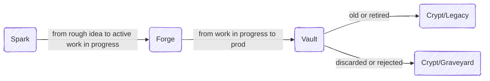

# Architecture Designs

A system for tracking architectural designs from napkin sketch to production (and beyond).

## The Journey



**Spark** ✨ - Where ideas start.
Rough sketches, workshop doodles, brainstorm artifacts.
No formal process, just raw creativity.

**Forge** 🔨 - Where work happens.
Active development, tied to real issues.
Designs evolve from concept to concrete plan.

**Vault** 🔒 - Where production lives.
Locked designs running in the wild.
Often moved to project repos with forwarding links.

**Crypt/Legacy** 🏆 - Where retired champions rest.
Designs that shipped and served their time.
Kept for reference and nostalgia.

**Crypt/Graveyard** 💀 - Where failures decompose.
Rejected ideas and abandoned experiments.
Learn from mistakes, but don't resurrect them.

### The Rules

- Spark or Forge → Graveyard: When ideas get killed
- Forge → Vault: When designs ship to production  
- Vault → Legacy: When designs get retired gracefully
- Only designs that reached production can go to Legacy
- Big projects can span multiple stages simultaneously

## Folder Structure

Each design lives in its own folder with a README.md file containing the design document.

```
├── Spark/                    # ✨ The napkin sketch zone
│   ├── README.md            # Explains the Spark stage
│   └── [DesignName]/        # Folder for design
│       └── README.md        # Design doc (optional at this stage)
│
├── Forge/                    # 🔨 The workshop
│   ├── README.md            # Explains the Forge stage
│   └── [DesignName]/        # Each active design gets a folder
│       └── README.md        # Design doc (required)
│
├── Vault/                    # 🔒 The hall of records
│   ├── README.md            # Explains the Vault stage
│   └── [DesignName]/        # Production designs
│       └── README.md        # Design doc or link to project repo
│
├── Crypt/                    # ⚰️ The final resting place
│   ├── README.md            # Explains the Crypt
│   ├── Legacy/              # 🏆 Retired champions
│   │   ├── README.md
│   │   └── [DesignName]/
│   │       └── README.md
│   └── Graveyard/           # 💀 Failed experiments
│       ├── README.md
│       └── [DesignName]/
│           └── README.md
│
└── README.md                # You are here
```
