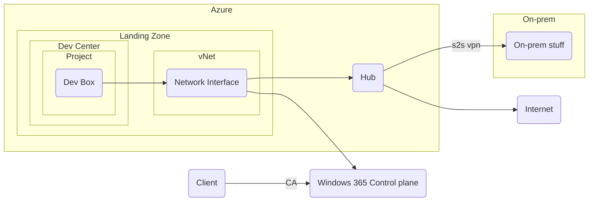

# Dev Box concept

## Scope

This design document describes how the Microsoft Dev Box service can be set up.
It will cover the infrastructure side of the configuration and conseptually how the service will be used.
Intune and client management will not be covered in this document, but will be used to manage the dev boxes.

## Rationale

The platform that team B is managing and developing is purely cloud based, and the team needs to be able to develop and test their services in a cloud environment.
If the on-prem environment is down, the team needs to be able to continue their work in a cloud environment.

## Conceptual Design

Microsoft Dev Box will act as the PAM for members of team B.
A dev box in the sense of this design and the Dev Box service from Microsoft is a virtual machine running in a Microsoft hosted environment, managed in our own tenant.
Members will use the Dev Box portal to manage their dev box(es).
The Dev Box service will be set up in its own landing zone and the dev boxes will be connected to the network in this landing zone.
Minimal customization will be done within the Dev Box service, as team members can customize their own dev boxes as needed.

The conceptual design of Dev Box includes the main components and their connections. The following mermaid diagram illustrates the high-level design:

## Logical Design

