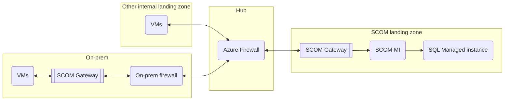
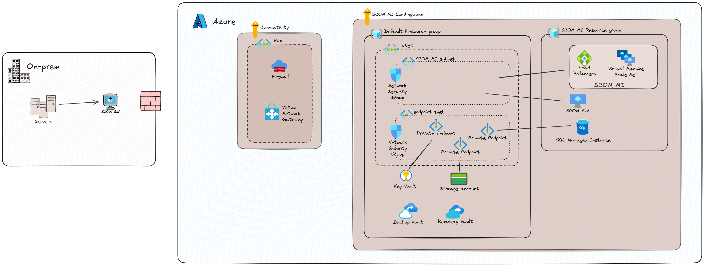

# Azure Monitor SCOM Managed Instance

## Conceptual design

The Azure Monitor SCOM Managed Instance along with its supporting infrastructure will be deployed in its own landing zone in Sweden Central. 
The landing zone will be a standard internal landing zone with peering to our hub.

## Logical design

