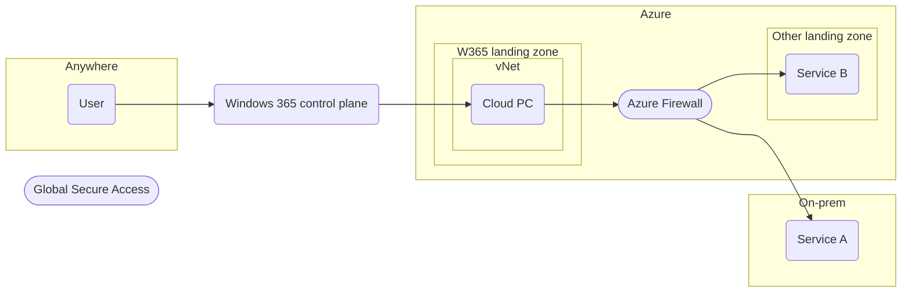
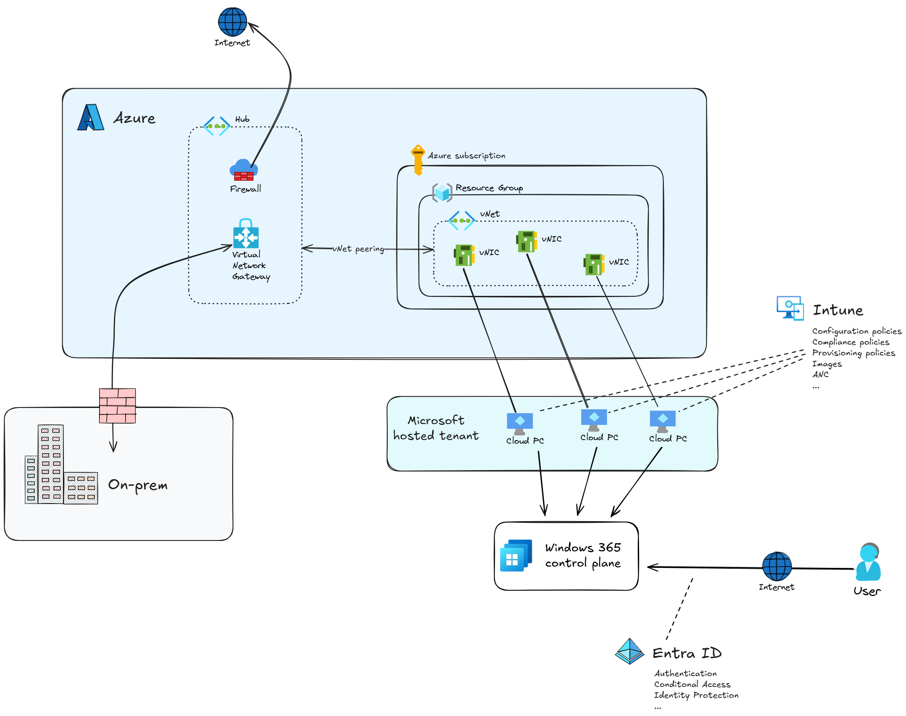

# Windows 365 PoC

This design is for an implementation of Windows 365 that can be set up and used as a proof of concept.

## Conceptual design

The design is based on setting up Windows 365 with Cloud PCs that will be connected a vNet in Azure.
From the the vNet, the Cloud PCs will be able to access other resources in Azure and they will have a connection to the internal network.
The following diagram shows the setup at a high level:

## Logical design

The logical design is based on the following components:

