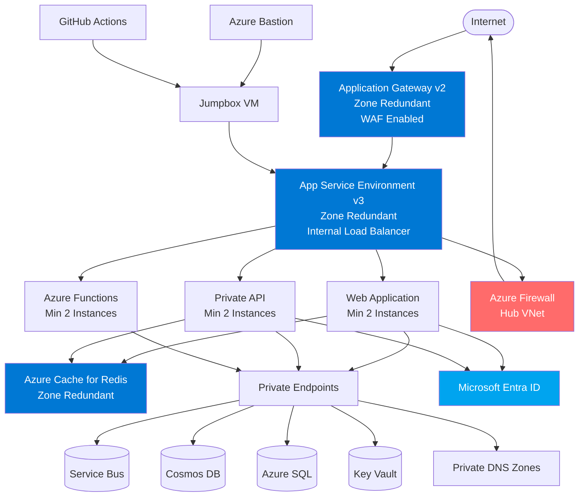

# High Availability App Service Environment Design for Contoso

## Scope

This design covers the deployment of a high-availability App Service Environment v3 solution for Contoso's mission-critical web applications.
The design focuses on zone-redundant architecture within a single Azure region (Norway East) to ensure business continuity and resilience against datacenter-level failures.

This design will cover:

- Zone-redundant App Service Environment v3 deployment
- Integration with Contoso's hub virtual network in Norway East
- Application Gateway with Web Application Firewall for inbound traffic
- Private endpoint connectivity to Azure PaaS services
- CI/CD deployment pipeline using GitHub Actions and Azure Bastion jumpbox
- Caching layer with zone-redundant Azure Cache for Redis

This design will NOT cover:

- Multi-region geo-distributed deployments
- Disaster recovery to secondary regions
- Application-level code or architecture
- Data replication strategies for databases
- Cost optimization beyond high-availability requirements
- Migration from existing applications

## Rationale

Contoso requires a highly available web application platform that can withstand availability zone failures while maintaining security and performance.
App Service Environment v3 provides dedicated, isolated compute resources within Contoso's virtual network with built-in support for zone redundancy.

Key reasons for this design:

- **Zone Redundancy**: App Service Environment v3 automatically distributes instances across multiple availability zones in Norway East, providing resilience against zone-level failures without additional configuration complexity.
- **Enterprise Security**: Internal load balancer (ILB) configuration keeps all application traffic within Contoso's virtual network, with no direct internet exposure.
- **Hub Integration**: The solution integrates seamlessly with Contoso's existing enterprise-scale hub in Norway East, leveraging shared services like Azure Firewall and Private DNS zones.
- **Managed Platform**: App Service provides a fully managed platform reducing operational overhead while maintaining enterprise-grade SLAs.
- **Cost Efficiency**: Zone redundancy in App Service Environment v3 doesn't incur extra charges beyond the instances used, making high availability cost-effective.

## Alternatives Considered

| Alternative | Pros | Cons | Reason Not Chosen |
|-|-|-|-|
| Azure Kubernetes Service (AKS) with zone redundancy | Greater container orchestration flexibility, supports complex microservices | Higher operational complexity, requires Kubernetes expertise, longer deployment times | Contoso's applications are standard web apps that don't require container orchestration complexity |
| App Service multi-region active-active | Geographic distribution, disaster recovery built-in | Significantly higher cost, complex data synchronization, increased latency for some users | Current requirement is for single-region high availability, not global distribution |
| Virtual Machine Scale Sets | Complete control over infrastructure, supports any application stack | High operational overhead, manual zone configuration, responsibility for patching and updates | Managed PaaS solution preferred to reduce operational burden |
| Standard App Service with availability zones | Lower cost than ASE, simpler deployment | Multi-tenant environment, less network isolation, no VNET integration for all features | Contoso requires dedicated resources and full VNET integration for security compliance |
| App Service Environment v2 | Familiar to existing teams | End of life (retired August 31, 2024), no zone redundancy support | Version 3 required for zone redundancy and continued support |

## Conceptual Design

### Key Components

- **Application Gateway v2**: Zone-redundant WAF-enabled ingress controller spanning all availability zones
- **App Service Environment v3**: Zone-redundant isolated environment with minimum 2 instances per App Service plan
- **Azure Cache for Redis**: Zone-redundant caching layer for improved performance and resilience
- **Private Endpoints**: Secure connectivity to Azure PaaS services without internet exposure
- **Azure Firewall**: Centralized egress filtering and inspection in hub virtual network
- **Azure Bastion**: Secure RDP/SSH connectivity to jumpbox for deployments
- **GitHub Actions**: CI/CD pipeline deploying through jumpbox to isolated environment

## Logical Design

The logical design diagram will be created in Excalidraw and stored as `Logical.png` in this directory.

### Network Architecture

**Virtual Network**: Integration spoke connected to Contoso hub (Norway East)

- Address Space: 10.100.0.0/16 (example - to be assigned by network team)

**Subnets**:

- Application Gateway Subnet: 10.100.1.0/24
- App Service Environment Subnet: 10.100.2.0/23 (minimum /24, /23 recommended)
- Private Endpoint Subnet: 10.100.4.0/24
- Azure Cache for Redis Subnet: 10.100.5.0/24
- Jumpbox Subnet: 10.100.6.0/27
- Azure Bastion Subnet: 10.100.7.0/26 (named AzureBastionSubnet)

### Availability Zones Configuration

**Zone-Redundant Services** (automatic distribution):

- App Service Environment v3: Instances spread across zones 1, 2, and 3
- Application Gateway v2: Spans all availability zones
- Azure Cache for Redis: Premium tier with zone redundancy enabled
- Azure Firewall: Built-in zone redundancy in hub

**Service Requirements**:

- Each App Service plan must have minimum 2 instances for zone redundancy
- Zone redundancy configured at App Service Environment level
- Individual App Service plans can opt-out of zone redundancy if needed (for non-production)

### Traffic Flow

**Inbound (Internet to Application)**:

1. Internet → Application Gateway (public IP, WAF inspection)
2. Application Gateway → App Service Environment ILB (private IP)
3. ILB → Web App instances (distributed across zones)
4. Web App → API/Functions (internal App Service Environment communication)

**Outbound (Application to Internet)**:

1. App Service Environment → Azure Firewall (via UDR in hub)
2. Azure Firewall → Internet (inspection and logging)

**Private Service Access**:

1. App Service → Private Endpoint (in PE subnet)
2. Private Endpoint → Azure Service (Service Bus, Cosmos DB, SQL, Key Vault)
3. DNS resolution via Private DNS zones in hub

### Deployment Flow

1. Developer commits code to GitHub repository
2. GitHub Actions workflow triggers build
3. Artifacts deployed to jumpbox VM via Azure Bastion
4. Jumpbox deploys to App Service Environment (internal network access)
5. Health probes verify deployment across zones

### Health and Resiliency

**Application Gateway Health Probes**:

- Endpoint: `/health` on each application
- Timeout: 15 seconds
- Checks: Web API availability and Redis cache connectivity

**Failover Behavior**:

- Application Gateway removes unhealthy instances from backend pool
- Traffic automatically routed to healthy instances in other zones
- Minimum 2 instances ensures availability during single instance failure

### Security Controls

- All applications isolated within App Service Environment (no shared tenancy)
- No direct internet access to applications (ILB only)
- WAF protects against OWASP Top 10 vulnerabilities
- Private endpoints for all Azure service connectivity
- Outbound traffic filtered through Azure Firewall
- Microsoft Entra ID authentication for applications
- Network security groups on all subnets
- Azure Bastion for secure administrative access (no public IPs on VMs)

## Implementation Notes

### Prerequisites

- Contoso hub virtual network in Norway East with Azure Firewall deployed
- Private DNS zones configured in hub for Azure services
- VNET peering between hub and spoke configured
- Network security groups defined for each subnet
- Azure Bastion deployed in hub or spoke

### Deployment Sequence

1. Create spoke virtual network and subnets with NSGs
2. Configure VNET peering to hub and UDRs for firewall
3. Deploy App Service Environment v3 with zone redundancy enabled
4. Create App Service plans with minimum 2 instances
5. Deploy Application Gateway v2 with WAF in zone-redundant mode
6. Create Azure Cache for Redis with zone redundancy
7. Deploy private endpoints and link to Private DNS zones
8. Configure jumpbox VM and Azure Bastion access
9. Set up GitHub Actions workflow with deployment secrets
10. Deploy applications and configure health endpoints
11. Configure Application Gateway backend pools and health probes
12. Test failover scenarios and validate zone redundancy

### Zone Redundancy Verification

To verify zone redundancy is working:

- Check App Service Environment properties for zone redundancy status
- Verify App Service plans have minimum 2 instances
- Confirm instances distributed across zones (Azure portal or CLI)
- Test application availability during simulated zone failure
- Monitor Application Insights for instance distribution

### Monitoring and Operations

- Enable Application Insights for all applications
- Configure Application Gateway WAF logging to Log Analytics
- Monitor App Service Environment metrics (CPU, memory, instance count)
- Set up alerts for health probe failures
- Track Redis cache performance and hit ratio
- Review Azure Firewall logs for outbound connectivity

### Cost Considerations

- App Service Environment v3: Charged per Isolated v2 instance (no additional zone redundancy fee)
- Application Gateway v2: WAF tier with capacity units based on throughput
- Azure Cache for Redis: Premium tier required for zone redundancy
- Private Endpoints: Per endpoint per hour charge
- Data transfer: Zone-to-zone transfer for Redis replication
- Azure Bastion: Standard or Premium tier for scaling

### Compliance and Governance

- All resources tagged with cost center, environment, and application name
- Resource naming follows Contoso naming convention
- RBAC configured with least privilege access
- Diagnostic logs sent to central Log Analytics workspace
- Azure Policy enforcement for required tags and allowed resources
- Backup policies for App Service apps configured
