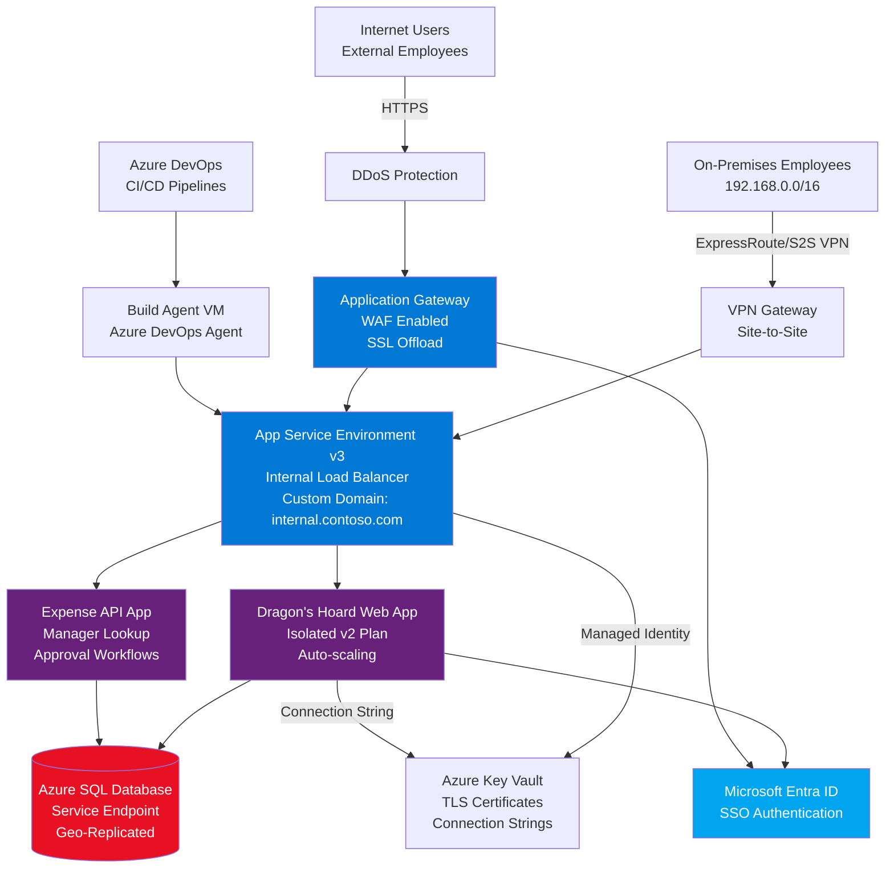

# Dragon's Hoard - Secure Expense Management Application for Contoso

## Scope

This design covers the production deployment of Dragon's Hoard, Contoso's internal expense management application, using a secure and fully managed Azure App Service Environment architecture.
Dragon's Hoard allows Contoso employees to submit, track, and approve expense reports with manager workflows and audit trails.

This design will cover:

- Internal Load Balancer (ILB) App Service Environment v3 deployment for dedicated, isolated hosting
- Application Gateway with Web Application Firewall (WAF) for internet-facing access
- VPN Gateway integration for secure on-premises employee access
- Azure SQL Database for relational data storage (expense reports, users, approvals)
- Azure DevOps CI/CD pipeline with build agent VM in isolated subnet
- Private endpoint connectivity to Azure services
- Custom domain configuration with TLS certificate management
- Microsoft Entra ID authentication for employee access

This design will NOT cover:

- Multi-region deployment or disaster recovery beyond SQL geo-replication
- Integration with external expense management systems or SAP
- Mobile native applications (web-based responsive design only)
- Receipt OCR or AI-powered expense categorization
- Credit card feed integration
- Alternative authentication methods (smart cards, MFA hardware tokens)
- Load testing or performance benchmarking results

## Rationale

Dragon's Hoard is a business-critical application that handles sensitive financial data and requires both high security and high availability.
Contoso's security and compliance requirements mandate that the application run in an isolated environment with no shared tenancy and controlled network access.

Key reasons for this design:

- **Dedicated Isolation**: App Service Environment v3 provides single-tenant dedicated compute with no resource sharing, meeting Contoso's data isolation requirements for financial applications.
- **Network Security**: ILB configuration ensures the application is only accessible through controlled entry points (Application Gateway from internet, VPN Gateway from on-premises), with no direct internet exposure.
- **Hybrid Access**: Employees can access Dragon's Hoard from Contoso offices via site-to-site VPN or from internet via Application Gateway with Entra ID authentication.
- **Managed Services**: Fully managed PaaS components reduce operational overhead while maintaining enterprise security controls and compliance.
- **CI/CD Integration**: Build agent VM within the virtual network enables secure deployment to the isolated App Service Environment without exposing deployment endpoints.
- **Scalability**: App Service Isolated tier provides autoscaling capabilities to handle month-end expense submission spikes.

The application name "Dragon's Hoard" reflects the D&D theme - employees submit their "treasure" (expenses) to the "hoard" (database), which is guarded by "dragons" (managers) who must approve the claims.

## Alternatives Considered

| Alternative | Pros | Cons | Reason Not Chosen |
|------------|------|------|-------------------|
| Azure Container Apps | Lower cost, serverless model, simpler management | Less network isolation, limited custom domain support, newer service with less enterprise adoption | Contoso requires proven enterprise-grade isolation and custom domain with complex SSL requirements |
| Azure Kubernetes Service (AKS) | Maximum flexibility, microservices support, container orchestration | High complexity, requires Kubernetes expertise, overhead for single application | Dragon's Hoard is a monolithic web app with API, doesn't need microservices complexity |
| Standard App Service (multi-tenant) | Significantly lower cost, simpler deployment, faster provisioning | Shared tenant environment, less network control, doesn't meet isolation requirements | Fails Contoso's security requirement for dedicated single-tenant hosting of financial applications |
| Virtual Machines with IIS | Complete infrastructure control, can match on-premises architecture | High operational burden, manual scaling, patching responsibility, no PaaS benefits | Contoso mandates PaaS-first strategy to reduce infrastructure management |
| Azure Cosmos DB for data tier | Global distribution, multi-model support, automatic scaling | Expense data is highly relational (users, managers, approvals, line items), SQL patterns well-established | Application data model is relational with complex joins and transactions, SQL Database is the right fit |
| GitHub Actions instead of Azure DevOps | Modern CI/CD, integrated with source control, larger ecosystem | Contoso standardized on Azure DevOps for all enterprise applications, compliance auditing requirements | Corporate standard is Azure DevOps for audit trails and integration with internal tools |

## Conceptual Design

### Key Components

- **VPN Gateway**: Site-to-site connectivity for on-premises employee access to Dragon's Hoard
- **Application Gateway + WAF**: Internet entry point with OWASP protection and SSL termination
- **App Service Environment v3**: ILB mode for network isolation, hosting both web and API apps
- **Azure SQL Database**: Relational database for expense data with virtual network service endpoints
- **Build Agent VM**: Self-hosted Azure DevOps agent for deploying to isolated environment
- **Azure Key Vault**: Secure storage for TLS certificates and application secrets
- **Microsoft Entra ID**: Single sign-on authentication for employee access

## Logical Design

The logical design diagram will be created in Excalidraw and stored as `Logical-DragonHoard.png` in this directory.

### Network Architecture

**Virtual Network**: Dragon's Hoard spoke network

- Address Space: 10.100.0.0/16
- Region: Norway East (connected to Contoso hub)

**Subnets**:

- Gateway Subnet: 10.100.255.224/27 (reserved for VPN Gateway)
- Application Gateway Subnet: 10.100.3.0/24
- App Service Environment Subnet (Web Tier): 10.100.1.0/24
- CI/CD Build Agent Subnet: 10.100.2.0/24
- Private Endpoint Subnet: 10.100.4.0/24

**Network Connectivity**:

- Site-to-Site VPN: On-premises (192.168.0.0/16) to Azure VPN Gateway
- VNET Peering: Dragon's Hoard spoke to Contoso hub (Norway East)
- ExpressRoute: Optional upgrade path for higher bandwidth

### Traffic Flow and Dataflow

**Employee Access from On-Premises**:

1. Employee at Contoso office (192.168.x.x) accesses dragonshoard.internal.contoso.com
2. Traffic routes through site-to-site VPN or ExpressRoute to VPN Gateway
3. VPN Gateway forwards to App Service Environment ILB (10.100.1.x)
4. ILB routes to Dragon's Hoard Web App
5. Web App authenticates user via Entra ID (optional, can use VPN trust)
6. Application presented to user

**External Employee Access from Internet**:

1. Remote employee navigates to dragonshoard.contoso.com
2. DDoS Protection filters malicious traffic
3. Traffic reaches Application Gateway (public IP)
4. Application Gateway enforces WAF rules (OWASP CRS)
5. Application Gateway requires Entra ID authentication
6. After authentication, traffic forwards to App Service Environment ILB
7. ILB routes to Dragon's Hoard Web App
8. Application presented to user

**Expense Report Submission Flow**:

1. User creates expense report in Dragon's Hoard Web App
2. Web App invokes Expense API App (internal ASE communication)
3. API App queries Azure SQL Database for manager information
4. Manager name and email retrieved and returned to Web App
5. Web App stores expense report in Azure SQL Database via service endpoint
6. Confirmation shown to user

**CI/CD Deployment Flow**:

1. Developer commits code to Azure DevOps repository
2. Azure DevOps triggers build pipeline
3. Build artifacts created and stored in Azure DevOps
4. Release pipeline triggers deployment to build agent VM
5. Build agent VM (with Azure DevOps agent installed) pulls artifacts
6. Build agent deploys to App Service Environment apps via internal network
7. Deployment complete, health checks validate

### Application Architecture

**Dragon's Hoard Web App** (ASP.NET Core MVC):

- Expense report submission forms
- Manager approval dashboard
- Reporting and analytics views
- User profile management
- Receipt upload and storage

**Expense API App** (ASP.NET Core Web API):

- RESTful API for expense operations
- Manager lookup from Entra ID
- Approval workflow logic
- Email notification triggers
- Data validation and business rules

**Database Schema** (Azure SQL Database):

- Users table (synced from Entra ID)
- Expenses table (expense reports with status)
- ExpenseLineItems table (individual expense entries)
- Approvals table (approval workflow tracking)
- Receipts table (blob storage references)
- AuditLog table (compliance tracking)

### Security Architecture

**Network Security**:

- Network Security Groups (NSGs) on all subnets with least-privilege rules
- App Service Environment in ILB mode (no direct internet access)
- Application Gateway as single internet entry point
- Service endpoints for SQL Database (traffic never leaves Azure backbone)
- Private endpoints for Key Vault and Storage (optional)

**Application Security**:

- Microsoft Entra ID authentication (single sign-on)
- Role-based access control (RBAC) for manager vs. employee views
- Web Application Firewall with OWASP CRS 3.x rules
- DDoS Protection on virtual network
- SSL/TLS encryption for all traffic (TLS 1.2 minimum)

**Data Security**:

- Azure SQL Database with Transparent Data Encryption (TDE)
- Always Encrypted for sensitive columns (employee personal data)
- SQL Database firewall rules (only ASE subnet allowed)
- Geo-replicated backups with 35-day retention
- Key Vault for secrets, certificates, and encryption keys

**Identity Security**:

- Managed identities for App Service to Key Vault access
- Service principals for Azure DevOps deployments
- No passwords stored in code or configuration files
- Certificate-based authentication for custom domains

### Custom Domain and TLS Configuration

**Custom Domain Suffix**: `internal.contoso.com`

- App Service Environment custom domain: `*.internal.contoso.com`
- Dragon's Hoard Web App: `dragonshoard.internal.contoso.com`
- Expense API App: `expenseapi.internal.contoso.com`
- SCM site: `dragonshoard.scm.internal.contoso.com`

**TLS Certificate Management**:

- Wildcard certificate for `*.internal.contoso.com` stored in Azure Key Vault
- Certificate format: PFX, less than 20 KB
- App Service Environment uses managed identity to retrieve certificate from Key Vault
- Certificate auto-renewal configured with Key Vault (Let's Encrypt or internal CA)
- Changes applied within 24 hours after Key Vault update

**DNS Configuration**:

- Internal DNS (on-premises): A records for `*.internal.contoso.com` pointing to VPN-accessible ILB IP
- External DNS (public): A record for `dragonshoard.contoso.com` pointing to Application Gateway public IP
- Private DNS zones in Azure for service endpoint name resolution

### High Availability and Scaling

**App Service Environment**:

- Isolated v2 SKU with faster processors and SSD storage
- Auto-scaling configured: 2-10 instances based on CPU and request metrics
- Scale-up during month-end (typical expense submission spike)
- Scale-down during mid-month periods

**Azure SQL Database**:

- Standard tier S3 (100 DTUs) for production workload
- Active geo-replication to paired region (Norway West) for DR
- Point-in-time restore enabled (35-day retention)
- Automated backups with geo-redundant storage

**Application Gateway**:

- Standard v2 SKU with auto-scaling
- Minimum 2 capacity units, maximum 10
- Health probes to App Service Environment apps
- SSL offloading to reduce compute on web apps

**Build Agent VM**:

- Standard D2s_v3 (2 vCPU, 8 GB RAM)
- Managed disk with Azure Backup enabled
- Not HA by design (deployment can wait if VM down)
- Can be shut down outside deployment windows for cost savings

### Monitoring and Compliance

**Application Monitoring**:

- Application Insights for both Web App and API App
- Real-time performance metrics and request telemetry
- Custom dashboards for expense submission patterns
- Alerts for failed requests, high latency, exceptions

**Security Monitoring**:

- Azure Security Center for threat detection
- Application Gateway WAF logs to Log Analytics workspace
- SQL Database auditing enabled with Log Analytics integration
- Key Vault access logs for certificate retrieval tracking

**Compliance and Audit**:

- Azure Policy enforcement for required tags and allowed resource types
- All diagnostic logs sent to central Log Analytics workspace
- Audit log table in SQL Database for all expense operations
- Retention policies aligned with financial data regulations (7 years)

## Implementation Notes

### Prerequisites

- Contoso hub virtual network in Norway East
- VPN Gateway or ExpressRoute connection to on-premises
- Azure DevOps organization with project for Dragon's Hoard
- Microsoft Entra ID tenant with employee identities
- Wildcard TLS certificate for `*.internal.contoso.com`
- Network team approval for IP address space allocation

### Deployment Sequence

1. Create Dragon's Hoard spoke virtual network (10.100.0.0/16) with all subnets and NSGs
2. Configure VNET peering to Contoso hub for shared services access
3. Deploy VPN Gateway and configure site-to-site VPN to on-premises
4. Deploy App Service Environment v3 in ILB mode in web tier subnet
5. Upload TLS certificate to Azure Key Vault
6. Configure App Service Environment with custom domain suffix and certificate
7. Create App Service plans (Isolated v2) with auto-scaling rules
8. Deploy Dragon's Hoard Web App and Expense API App to App Service plans
9. Create Azure SQL Database with service endpoint to ASE subnet
10. Configure SQL Database schema and seed data (users, approval workflows)
11. Deploy build agent VM and install Azure DevOps agent
12. Configure Azure DevOps build and release pipelines
13. Deploy Application Gateway with WAF in internet-facing subnet
14. Configure Application Gateway backend pools pointing to ASE apps
15. Enable Microsoft Entra ID authentication on Application Gateway
16. Configure DNS records (internal and external)
17. Enable monitoring, logging, and alerting
18. Perform security testing and penetration testing
19. User acceptance testing with pilot group
20. Production cutover from legacy expense system

### Configuration Details

**App Service Environment Settings**:

- Custom domain suffix: `internal.contoso.com`
- ILB IP address: 10.100.1.10 (example)
- Managed identity: System-assigned
- Key Vault access policy: Certificate Get and List permissions

**Application Gateway Settings**:

- SKU: Standard_v2 (WAF_v2 for production)
- Tier: WAF
- Public IP: Static
- Listeners: HTTPS only (port 443)
- Backend pool: ASE ILB IP address
- HTTP settings: HTTPS to backend (end-to-end TLS)
- Health probe: `/health` endpoint on applications

**Azure SQL Database Settings**:

- Server name: `dragonshoard-sql.database.windows.net`
- Database name: `DragonHoardDB`
- Service tier: Standard S3 (100 DTU)
- Collation: SQL_Latin1_General_CP1_CI_AS
- Firewall rules: Allow Azure services, Allow ASE subnet (service endpoint)
- Geo-replication: Secondary in Norway West

**Auto-scaling Rules**:

- Scale out: CPU > 70% for 5 minutes, add 1 instance
- Scale in: CPU < 30% for 10 minutes, remove 1 instance
- Minimum instances: 2 (for HA)
- Maximum instances: 10 (cost control)
- Cool down period: 5 minutes

### Security Hardening

**Application Gateway WAF Rules**:

- OWASP CRS 3.2 rule set enabled
- Prevention mode (not just detection)
- Custom exclusions for false positives (if needed after testing)
- Geo-filtering: Block traffic from high-risk countries
- Rate limiting: 100 requests per minute per IP

**SQL Database Security**:

- Transparent Data Encryption (TDE) enabled
- Advanced Threat Protection enabled
- Vulnerability assessment scheduled weekly
- Dynamic data masking on sensitive columns (SSN, bank accounts)
- Row-level security for multi-tenant isolation (if future requirement)

**Build Agent Security**:

- Just-in-Time (JIT) VM access enabled
- Azure Disk Encryption enabled
- Antimalware extension installed
- No public IP address (deploy via Azure Bastion or VPN)
- Service principal with minimal RBAC permissions

### Testing and Validation

**Functional Testing**:

- Expense submission end-to-end workflow
- Manager approval process
- Email notifications
- Receipt upload and retrieval
- Reporting accuracy

**Security Testing**:

- OWASP ZAP scan against Application Gateway
- Penetration testing by third-party (annual requirement)
- SSL Labs test for TLS configuration
- Entra ID authentication flow validation
- Network isolation testing (attempt direct ASE access)

**Performance Testing**:

- Load test with 500 concurrent users (month-end scenario)
- API response time benchmarking
- SQL Database query performance analysis
- Auto-scaling trigger validation
- Application Gateway capacity planning

**Disaster Recovery Testing**:

- Failover to SQL Database geo-replica
- Recovery time objective (RTO) validation: < 4 hours
- Recovery point objective (RPO) validation: < 1 hour
- Backup restore testing (quarterly)

## Operational Procedures

### Deployment Procedure

1. Developer creates feature branch in Azure DevOps
2. Pull request triggers build validation
3. Code review and approval by team lead
4. Merge to main branch triggers production build
5. Build pipeline creates artifacts and runs unit tests
6. Release pipeline requires manual approval for production deployment
7. Release deploys to build agent VM
8. Build agent executes deployment script to App Service
9. Smoke tests run automatically post-deployment
10. Deployment notification sent to team via email/Teams

### Certificate Renewal Procedure

1. New certificate uploaded to Key Vault (30 days before expiration)
2. App Service Environment automatically detects new certificate
3. Certificate applied within 24 hours (no manual action required)
4. Verify new certificate via browser and SSL Labs test
5. Old certificate remains in Key Vault for 90 days (rollback capability)

### Incident Response

**Application Down (Detected via Application Insights)**:

1. Alert triggers notification to on-call engineer
2. Check Application Gateway health probes
3. Verify App Service Environment instance health
4. Review Application Insights exceptions and logs
5. If needed, manually scale out or restart app instances
6. Engage vendor support if platform issue

**SQL Database Performance Issues**:

1. Check Database DTU consumption in Azure portal
2. Review slow query log in SQL Database insights
3. Analyze query execution plans
4. Apply index recommendations from Azure Advisor
5. Scale up database tier if sustained high DTU
6. Engage DBA team for complex performance tuning

**Security Incident (WAF Alert)**:

1. Review Application Gateway WAF logs in Log Analytics
2. Identify attack pattern and source IP addresses
3. Add custom WAF rules or IP blocking if needed
4. Escalate to security team if sophisticated attack
5. Document incident in security incident management system
6. Review and update WAF rules post-incident

### Cost Management

**Monthly Cost Estimate (Production)**:

- App Service Environment v3 (Isolated v2): ~$1,000 for base + $200 per instance (avg 4 instances) = $1,800
- Application Gateway v2 (WAF): ~$250 + capacity units
- Azure SQL Database (S3): ~$150
- VPN Gateway (VpnGw1): ~$150
- Build Agent VM (D2s_v3, shut down 16h/day): ~$25
- Storage, bandwidth, Key Vault, monitoring: ~$75
- **Total estimated monthly cost: ~$2,450**

**Cost Optimization**:

- Use reserved instances for App Service Environment (save up to 37%)
- Auto-shutdown build agent VM outside business hours
- Archive old expense data to cheaper storage tiers
- Right-size SQL Database based on actual DTU usage
- Review and remove unused resources quarterly
