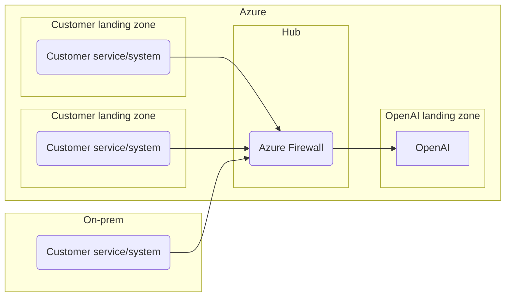
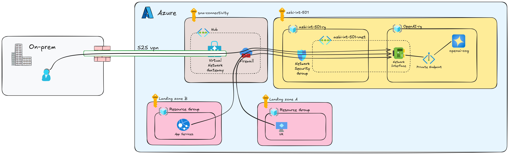

# Shared Services - OpenAI

This design describes how a shared OpenAI service is to be set up in Azure by team B.

## Scope

This design will cover the setup of an OpenAI Service deployed in a landing zone in Azure.
It will not cover the setup of the customer services that will use the OpenAI service.
It will not cover any infrastructure that is not directly related to the OpenAI service.
It will not cover how other services will be setup to use the OpenAI service.

## Rationale

Contoso has a need to enable developers to make use of OpenAI in their services.
To accelerate the development of services that make use of OpenAI, it is desirable to have a shared service that developers can use.

## Intended usage of the OpenAI service

The shared OpenAI service will be available for use by developers that have a need for it.
It will be intended as an enablement service, but not as a production service.
If a service has a need for OpenAI in production, it should set up its own instance of OpenAI.

## Conceptual design

The OpenAI service will be set up in its own landing zone.
Those that want to make use of the service can do so by sending API requests to the service.
Guide for usage will be published in our portal.

Diagram of the conceptual design:

## Logical design

This logical design should be seen in conjunction with the conceptual design.
It will follow the same principals as the conceptual design, but will add a bit more detail.

### Landing zone

The OpenAI service will be delivered from a new landing zone.  
Creating a new landing zone just for the OpenAI service is a conscious choice to separate the OpenAI service from other services, both in terms of networking, costs and security.

### Network

The OpenAI service will make use of a private endpoint that will be connected to the vNet provided by the landing zone.  
This will ensure we have observability and control over the traffic to and from the OpenAI service.  
The NSG will be configured to only allow traffic from rfc1918 ip ranges and only on tcp/443.

### Identity

The OpenAI service will make use of a managed identity to authenticate with other services in the landing zone.  
This will ensure that the OpenAI service can be secured and that we can control access to it.

### Encryption

The OpenAI service will make use of encryption at rest and in transit.  
This will ensure that the data is secure when it is stored and when it is transmitted.  
We will generate a new key, store it in an Azure Key Vault set up in the landing zone and use it as the customer managed key in the OpenAI deployment.

### Models

The OpenAI service will have one model deployed: gpt-5.  
Other models can be deployed later on if there is a need for it, but the gpt-5 model is the only one that will be deployed initially.
